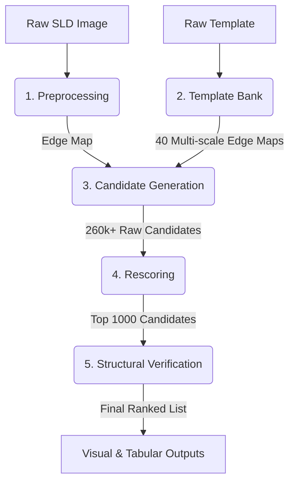

# Pipeline Overview

This document provides a high-level architectural walkthrough of the complete Symbol Localization pipeline. The pipeline operates entirely deterministically, without any machine learning or neural networks, relying solely on geometric matching and topological verification.

## Core Objective

Given a single template image of a target symbol (e.g., a Current Transformer) and a massive, complex Single Line Diagram (SLD), return a ranked list of bounding boxes sorted by likelihood of containing the target symbol.

## The 5-Stage Architecture

### Stage 1: Preprocessing
**Module**: `src/preprocessing/`

Before any matching can occur, both the SLDs and the template must be converted into clean, 1-pixel-thick binary edge representations. 
1. **Grayscale Conversion**: Standard luminance weighting (`0.299R + 0.587G + 0.114B`).
2. **Denoising**: Minimal smoothing to remove rendering artifacts without blurring crisp lines.
3. **Binarization**: Otsu's method to adaptively find the optimal threshold. Since diagrams are mostly white background with black lines, the intensity histogram is strongly bimodal, making Otsu extremely robust.
4. **Edge Extraction**: Canny edge detection to produce the final 1px-thick sparse binary edge map.

### Stage 2: Template Bank Generation
**Module**: `src/template_bank/`

The target symbol can appear in the SLDs at various scales and orientations. We must generate a "bank" of template variants to match against.
*   **Scales**: 10 scales ranging from 0.15 to 0.40 relative to the original template.
*   **Orientations**: 4 rotations (0°, 90°, 180°, 270°).
*   **Total Variants**: 40 edge maps per query template.
*   **Methodology (Method D3)**: Standard image downsampling (`cv2.resize`) dilutes 1px edges to the point of disappearing at small scales (e.g., 0 edge pixels at scale 0.15). We use **Coordinate Scaling + Anti-Aliased Rasterization** (Method D3), which scales mathematical coordinates rather than pixels, ensuring 100% continuous topology preservation even at extreme minification.

### Stage 3: Candidate Generation (Chamfer Matching)
**Module**: `src/candidate_generation/` and `src/template_matching/`

This is the primary localization step. We want to find regions in the SLD edge map that closely match our template edge maps.
1. **Distance Transform**: We compute the $L_2$ (Euclidean) distance transform of the SLD edge map. Every pixel value now represents the distance to the nearest edge.
2. **Dense Matching**: For all 40 template variants, we slide the template across the SLD distance transform. At each position, we sum the distance values that fall exactly underneath the template's edge pixels. This is the **Chamfer Distance**.
3. **Optimization**: This sliding window is computed efficiently in $O(1)$ time per pixel using cross-correlation (`cv2.filter2D`).
4. **Local Minima Extraction**: We extract the local minima (positions with the lowest Chamfer distance) across all scales/rotations to generate a pool of raw candidate bounding boxes (typically ~260,000 candidates across the dataset).

### Stage 4: Coverage $\times$ Area Rescoring
**Module**: `src/verification/coverage_rescoring.py`

Raw Chamfer matching suffers from a severe **small-template bias**. A very small template has few edge pixels. If placed over a dense region (like text or intersecting conductors), all its few edge pixels easily fall on or near an SLD edge, resulting in a near-zero Chamfer score. True symbols, which are larger and have some rendering deviations, score worse.

To counteract this, we normalize the raw scores using two factors:
1.  **Template Area**: Penalizes matches made by very small templates.
2.  **Coverage Ratio**: The percentage of the candidate patch's edges that are "covered" by the template edges. 

The resulting `CoverageAreaScore` aggressively reranks the candidates, pushing true symbols up from rank ~20,000 into the top 1,000.

### Stage 5: Structural Verification
**Module**: `src/verification/structural_verification.py`

Because circuit symbols share fundamental geometric sub-primitives (straight lines, corners), geometric matching alone (Chamfer + Coverage) cannot distinguish the target MR symbol from visually similar non-target symbols.

We apply a strict budget, passing only the top 1,000 candidates per SLD to the verification layer. For each candidate patch, we compute 25 distinct topological and structural features, such as:
*   `Stroke_Count`: Number of connected structural lines.
*   `Branch_Point_Count`: Number of T-junctions or intersections.
*   `Euler_Number`: Topological invariant indicating holes vs. objects.
*   `Aspect_Ratio`: Bounding box proportions.

These features form a structural profile used to separate the true symbols from the remaining false positives (often dense text or complex conductor intersections).

## The Output

The pipeline outputs:
1. A **CSV ranking list** for every SLD, detailing the candidate coordinates, scale, rotation, Chamfer score, Coverage ratio, and all 25 structural features.
2. **Diagnostic Visuals** mapping the score landscape and providing candidate galleries for human review.
