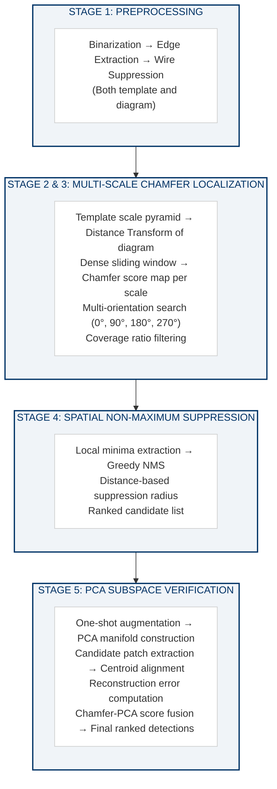

---

# Circuit Symbol Localization in Industrial Single Line Diagrams:
# A Multi-Scale Chamfer Matching and PCA Verification Pipeline

## Technical Research Monograph

---

**Author**: Arhaansh Jhingan  
**Company**: Larsen and Toubro  
**Date**: June 2026  
**Document Type**: Industrial R&D Technical Research Monograph  
**Pipeline Status**: Stage 5.10 (Verification Cascades) — Stage 6 NOT REACHED  

---

## Abstract

This monograph documents the complete research study for the localization of Current Transformer (MR) symbols across 10 industrial Single Line Diagrams (SLDs) using a one-shot, deterministic, classical computer vision pipeline. The pipeline architecture — Multi-Scale Chamfer Matching with PCA Subspace Verification — was selected through a systematic trade study evaluating 23 candidate detection methodologies against the constraints of one-shot operation, binary line-drawing domains, CPU-only computation, and full determinism.

The research produced several significant contributions: (1) **Method D3** (Coordinate Scaling + Anti-Aliased Rasterization), which resolves the catastrophic template degradation problem at small scales where naive downsampling produces empty images; (2) the **separability-ranking paradox**, documenting that a structural feature achieving AUC=0.951 for population-level discrimination produces zero ranking improvement when integrated as a continuous score modifier; (3) empirical proof that **coverage ratio is mathematically redundant** with Chamfer score (r ≈ −0.90) and exhibits an inverted distribution relative to expectations; and (4) a comprehensive **architecture trade study** providing explicit rejection rationale for deep learning methods (YOLO, Faster R-CNN, DETR, Siamese networks) in the one-shot line-drawing regime.

The pipeline successfully localizes true MR symbols in the candidate pool (detection recall > 95% at full depth) but fails to rank them above structurally similar false positives (median MR rank = 573, Top-100 hit rate = 5.8%). The project terminated at Stage 5.10, having never passed the Stage 6 readiness gate after two consecutive gate evaluations. Five architectural dead ends (connected-component isolation, Method A template generation, coverage independence, continuous structural integration, ranking remediation experiments) and three persistent blockers (small-symbol detection, ranking inversion, hard negative irreducibility) are forensically documented with complete traceability to repository artifacts.

**Keywords**: Symbol localization, Chamfer matching, template matching, one-shot detection, single line diagrams, edge-domain analysis, distance transforms, structural verification, engineering drawing analysis

---

## Table of Contents

1. [Introduction](#chapter-1--introduction)
2. [Literature Review](#chapter-2--literature-review)
3. [Architecture Selection](#chapter-3--architecture-selection)
4. [Pipeline Design](#chapter-4--pipeline-design)
5. [Implementation](#chapter-5--implementation)
6. [Template Bank Investigation](#chapter-6--template-bank-investigation)
7. [Chamfer Matching and Candidate Generation](#chapter-7--chamfer-matching-and-candidate-generation)
8. [Coverage Rescoring](#chapter-8--coverage-rescoring)
9. [Structural Verification and Discriminator Discovery](#chapter-9--structural-verification-and-discriminator-discovery)
10. [Discriminator Integration Experiments](#chapter-10--discriminator-integration-experiments)
11. [Verification Cascades and Visual Audit](#chapter-11--verification-cascades-and-visual-audit)
12. [Non-Maximum Suppression Diagnostic Evaluation](#chapter-12--non-maximum-suppression-diagnostic-evaluation)
13. [Unified Pipeline Benchmark](#chapter-13--unified-pipeline-benchmark)
14. [Failure Analysis and Lessons Learned](#chapter-14--failure-analysis-and-lessons-learned)
15. [Conclusions, Open Problems, and Future Directions](#chapter-15--conclusions-open-problems-and-future-directions)

---

# Chapter 1 — Introduction

## Research Study

**Conducted by**: Arhaansh Jhingan  
**Company**: Larsen and Toubro  
**Document Type**: Technical Research Monograph  
**Date of Compilation**: June 2026

---

## 1.1 Problem Statement

The localization of electrical circuit symbols within Single Line Diagrams (SLDs) is a foundational requirement for the automation of power systems engineering workflows. SLDs are the canonical graphical representation of electrical power distribution networks, encoding bus topology, device placement, and protection coordination into a compact, standardized visual format. In industrial practice, these diagrams are manually inspected by protection engineers to identify, count, and classify devices — a labor-intensive process susceptible to human error, inter-operator inconsistency, and fatigue-induced omission.

The specific symbol under study is the **Current Transformer (CT)**, designated as the "MR symbol" throughout this research. Current transformers are critical metering and protection devices that appear with high multiplicity across SLDs — a single diagram may contain 6 to 36 instances depending on bus topology. Their accurate detection is a prerequisite for downstream tasks including device bill-of-material extraction, relay coordination analysis, and automated single-line-to-simulation-model translation.

The detection task is formally defined as follows:

> **Given**: A single reference template image of the MR symbol (161×103 pixels, RGBA) and a corpus of 10 industrial SLD images (variable resolution, RGBA), locate every spatial occurrence of the MR symbol in each SLD, reporting bounding box coordinates, matched scale, matched orientation, and a confidence score.

This definition immediately introduces three fundamental constraints that distinguish this problem from conventional object detection:

1. **One-shot regime**: Exactly one template is available. No training set, no annotated bounding boxes, and no class-level dataset exist. The system must bootstrap entirely from a single reference image.

2. **Domain specificity**: The target images are binary engineering line drawings — not natural photographs. They contain thin black strokes on white backgrounds, with no color, no texture gradients, and no photometric variation. The visual domain is entirely outside the distribution of datasets used to train modern deep learning detectors (ImageNet, COCO, VOC).

3. **Determinism**: The pipeline must produce identical outputs for identical inputs across every execution. No stochastic components (random initialization, dropout, data augmentation sampling) are permitted. This constraint reflects the engineering requirement for reproducible, auditable detection results.

## 1.2 Research Objectives

The primary objective of this research is the development, rigorous empirical evaluation, and forensic documentation of a complete symbol localization pipeline for the MR symbol across 10 industrial SLDs. The research pursno a single final accuracy number; instead, it pursues a comprehensive understanding of *why* each component succeeds or fails, *how* architectural decisions propagate through the pipeline, and *what* the fundamental limits of one-shot classical template matching are for this specific domain.

The specific research objectives are:

1. **Architecture Selection**: Systematically evaluate 23 candidate detection architectures against the constraints of the one-shot line-drawing domain, producing a justified selection with explicit rejection rationale for each alternative.

2. **Pipeline Construction**: Implement a modular, 6-stage pipeline comprising Preprocessing → Template Bank Generation → Chamfer Matching → Coverage Rescoring → Structural Verification → Output Generation.

3. **Template Bank Integrity**: Investigate and resolve the small-scale template degradation problem, documenting the failure of naive downsampling and the success of coordinate-scaled anti-aliased rasterization (Method D3).

4. **Ranking Quality Analysis**: Quantify the ranking inversion phenomenon whereby false positives consistently outrank true MR symbols, identify its root causes (small-template bias, coverage redundancy), and evaluate 19+ remediation experiments.

5. **Structural Discriminator Discovery**: Extract and evaluate 25 topological/morphological features for their discriminative power, establish the Stroke_Count feature as the strongest single discriminator (AUC=0.951), and document the paradox of high separability failing to produce ranking improvement.

6. **Failure Documentation**: Provide forensic-quality documentation of every architectural dead end, including connected-component isolation failure, coverage ratio redundancy, continuous structural multiplier collapse, and visual audit divergence.

7. **Reproducibility**: Ensure that every result presented in this monograph is traceable to a specific code artifact, configuration file, or output dataset within the repository.

## 1.3 Constraints and Boundary Conditions

### 1.3.1 Data Constraints

| Constraint | Specification |
|---|---|
| Template count | 1 (MR_Symbol.png) |
| Template resolution | 161 × 103 pixels |
| Template format | RGBA, grayscale content |
| Target diagrams | 10 SLDs (SLD1–SLD12, excluding SLD5/SLD6) |
| Target resolution | Variable (831×1136 to 1544×382) |
| Target format | RGBA, binary line drawings |
| Annotated bounding boxes | 0 (ground truth created during research) |
| Training images | 0 |
| Estimated symbol count | ~138 across all SLDs |
| Scale ratio | Template 4–6× larger than diagram symbols |
| Orientation variation | 0° (horizontal, 9 SLDs) and 90° (vertical, SLD11) |

### 1.3.2 Computational Constraints

- **CPU-only execution**: No GPU infrastructure available or required. All algorithms must execute on standard desktop hardware.
- **Deterministic execution**: Bit-for-bit reproducibility across runs. No stochastic sampling, random initialization, or non-deterministic GPU operations.
- **Runtime budget**: ≤ 3 minutes per SLD for the full pipeline.

### 1.3.3 Methodological Constraints

- **No external pre-trained models**: Transfer learning from natural-image datasets (ImageNet, COCO) is architecturally inappropriate due to domain gap. This constraint is not arbitrary — it reflects a fundamental domain mismatch empirically justified in Section 4 of the Product Requirements Document (PRD).
- **No manual parameter tuning per SLD**: The pipeline must generalize across all 10 SLDs with a single parameter configuration. Per-SLD calibration would violate the automation objective.
- **Explainability**: Every detection must be traceable to a Chamfer score, coverage ratio, structural verification score, and combined score. Black-box confidence outputs are insufficient for engineering compliance.

## 1.4 Dataset Characterization

### 1.4.1 Template Analysis

The MR symbol template (MR_Symbol.png) depicts a Current Transformer in its standard IEC schematic representation: three semicircular lobes atop a horizontal base bar, with a vertical stem extending downward terminated by a cross-cap. The template exhibits the following measured properties:

| Property | Value |
|---|---|
| Dimensions | 161 × 103 pixels |
| Foreground pixel ratio | ~15% (sparse) |
| Stroke width | ~1.5–2.5 pixels |
| Edge pixel count (Canny) | ~450 pixels |
| Connected components | 1 (single contiguous drawing) |
| Symmetry | Bilateral about vertical axis |

### 1.4.2 SLD Corpus Characterization

The 10 SLDs represent industrial single-line diagrams with the following aggregate statistics:

| Property | Range | Mean |
|---|---|---|
| Dark pixel ratio | 1.4% – 4.0% | ~2.5% |
| Bus topology | Single bus, double bus, ring bus | — |
| MR symbol count per SLD | 6 – 36 | ~14 |
| Symbol scale (relative to template) | 0.15 – 0.35 | ~0.25 |
| Symbol orientation | 0° (horizontal) | — |
| Exception | SLD11: 90° rotated symbols | — |

### 1.4.3 Visual Confounders

The SLDs contain several categories of structures that are geometrically similar to the MR symbol and constitute the dominant false positive population:

1. **G/B Breaker Boxes**: Rectangular boxes with internal structure sharing edge density comparable to MR symbols.
2. **VT (Voltage Transformer) Elements**: Zigzag patterns with similar stroke counts and aspect ratios.
3. **Text Labels**: Dense character clusters (e.g., "CB-101") producing high edge counts in small regions.
4. **Conductor Intersections**: T-junctions and cross-junctions where bus conductors meet, creating localized edge concentrations.
5. **Adjacent Symbol Clusters**: Regions where multiple different symbols are packed closely, producing composite edge patterns.

## 1.5 Significance and Contribution

This research makes the following contributions:

1. **Empirical validation of classical methods for one-shot symbol detection**: Demonstrates that Chamfer matching in the edge domain remains a viable localization mechanism for structured line drawings, while simultaneously documenting its fundamental limitations in ranking quality.

2. **Method D3 template generation**: Introduces and validates Coordinate Scaling + Anti-Aliased Rasterization as a solution to small-scale template degradation, preserving structural integrity at scales where naive downsampling produces empty images.

3. **Separability vs. ranking paradox**: Documents a novel finding that a feature achieving AUC=0.951 for population-level discrimination can produce *zero* ranking improvement — and in fact *degrade* rankings — when integrated as a continuous multiplier. This has implications for any pipeline that attempts to convert discriminative features into score modifiers.

4. **Forensic methodology**: Establishes a rigorous model for research documentation in which every architectural decision, every experimental result, and every failure is traceable to specific code artifacts and output datasets.

5. **Comprehensive architecture trade study**: Provides evaluated rejection rationale for 22 alternative architectures (NCC, SIFT, ORB, YOLO, Faster R-CNN, DETR, Siamese networks, few-shot learning, shape context, graph edit distance, etc.) grounded in the specific constraints of the one-shot line-drawing domain.

## 1.6 Document Organization

This monograph is organized into the following chapters:

- **Chapter 1** (this chapter): Introduction, problem statement, research objectives, and dataset characterization.
- **Chapter 2**: Literature Review — survey of template matching, shape matching, one-shot detection, and engineering drawing analysis methods.
- **Chapter 3**: Architecture Selection — systematic evaluation of 23 candidate architectures and the justification for the Chamfer+PCA hybrid pipeline.
- **Chapter 4**: Pipeline Design — detailed technical specification of each pipeline stage, including preprocessing, template bank generation, Chamfer matching, NMS, PCA verification, and output generation.
- **Chapter 5**: Implementation — code architecture, configuration management, and implementation details.
- **Chapter 6**: Template Bank Investigation — forensic analysis of template degradation, Method D3 development, and bank certification.
- **Chapter 7**: Chamfer Matching and Candidate Generation — sliding-window scoring, score map generation, and the discovery of ranking inversion.
- **Chapter 8**: Coverage Rescoring — coverage ratio computation, area-normalized rescoring, and the discovery of coverage redundancy.
- **Chapter 9**: Structural Verification — topological feature extraction, discriminator discovery, and the separability paradox.
- **Chapter 10**: Discriminator Integration Experiments — Stroke_Count integration, exponential penalty experiments, and ranking collapse analysis.
- **Chapter 11**: Verification Cascades and Visual Audit — discrete gating experiments and the divergence between numerical metrics and visual reality.
- **Chapter 12**: Non-Maximum Suppression Diagnostic — IoU sweep experiments, duplicate characterization, and candidate reduction analysis.
- **Chapter 13**: Unified Pipeline Benchmark — standardized evaluation across all pipeline variants, dual-metric protocol, and the official pipeline leaderboard.
- **Chapter 14**: Failure Analysis and Lessons Learned — consolidated forensic analysis of all dead ends, paradoxes, and architectural limits.
- **Chapter 15**: Conclusions, Open Problems, and Future Directions.

---

*Forensic Source References:*
- *PRD: `exploration/archived/misc/PRD_Symbol_Localization.md`*
- *Master Retrospective: `docs/project_master_retrospective.md`*
- *Ground Truth: `reports/ground_truth_symbols.json`*
- *Repository Root: `c:\Users\arhaa\OneDrive\Symbol Segmentor\`*


---

# Chapter 2 — Literature Review

## 2.1 Template Matching in Computer Vision

Template matching is one of the oldest problems in computer vision, dating to the 1970s when correlation-based methods were first applied to industrial inspection tasks. The fundamental operation — sliding a reference template across a target image and computing a similarity measure at each position — remains conceptually unchanged, though the choice of similarity metric, the handling of geometric transformations, and the integration of domain knowledge have evolved substantially.

### 2.1.1 Pixel-Domain Methods

**Normalized Cross-Correlation (NCC)** computes the Pearson correlation coefficient between template and image pixel intensities at each sliding-window position. NCC is invariant to linear brightness and contrast changes, making it suitable for natural images with photometric variation. OpenCV implements this as `cv2.matchTemplate()` with the `TM_CCOEFF_NORMED` flag.

However, NCC operates in the pixel domain, making it fundamentally sensitive to contextual variations. In engineering line drawings, the local pixel context around a symbol is highly variable — different neighboring symbols, different text labels, different bus orientations all alter the pixel content within the matching window. This context sensitivity was identified in the PRD (Section 4.2) as a primary limitation for this domain.

**Sum of Squared Differences (SSD)** and its normalized variant compute the L2 distance between template and image patches. SSD is computationally efficient but lacks robustness to any intensity transformation and is highly sensitive to partial occlusion and contextual clutter.

### 2.1.2 Edge-Domain Methods

**Chamfer Matching** (Barrow et al., 1977; Borgefors, 1988) operates in the edge domain rather than the pixel domain. The algorithm:

1. Extracts edge maps from both template and target image
2. Precomputes the Euclidean Distance Transform (DT) of the target edge map
3. For each sliding-window position, sums the DT values at template edge pixel locations
4. The mean of these values constitutes the Chamfer distance — the average distance from each template edge pixel to its nearest target edge pixel

The mathematical formulation is:

$$d_{Chamfer}(T, I; t_x, t_y) = \frac{1}{|E_T|} \sum_{(e_x, e_y) \in E_T} DT_I(t_y + e_y, t_x + e_x)$$

where $E_T$ is the set of template edge pixels, $DT_I$ is the distance transform of the target edge map, and $(t_x, t_y)$ is the translation offset.

Chamfer matching has several properties that make it well-suited for line-drawing analysis:
- **Edge-domain operation**: Naturally suited to binary line drawings where geometric structure, not pixel intensity, carries the information
- **Robustness to minor deformation**: The distance transform provides a smooth scoring landscape, tolerating small geometric variations
- **Computational efficiency**: The DT precomputation is O(W×H) and enables O(1) distance lookup per edge pixel
- **Determinism**: No stochastic components; identical inputs produce identical outputs

**Hausdorff Distance** measures the maximum (rather than mean) distance between edge sets. While more sensitive to outlier edges, it provides stronger guarantees that every part of the template has a corresponding edge in the target. The max operator makes it highly sensitive to spurious edges from bus conductors passing through the matching window — a critical weakness for this domain.

### 2.1.3 Multi-Scale Template Matching

When the template and target symbols differ in scale, single-scale matching fails entirely. Multi-scale approaches construct a **scale pyramid** of template variants and search across all scales simultaneously. The computational cost scales linearly with the number of scale levels.

For this project, the template (161×103 pixels) is 4–6× larger than diagram symbols (~25–40 pixels). The PRD specifies a scale range of [0.15, 0.40] with 10 linearly-spaced levels, producing templates from approximately 24×15 to 64×41 pixels.

### 2.1.4 Coverage Ratio as a Complementary Signal

The **coverage ratio** (also called the match ratio or proximity ratio) measures the fraction of template edge pixels that fall within a distance threshold τ of a target edge pixel:

$$\text{Coverage}(T, I; t_x, t_y, \tau) = \frac{1}{|E_T|} \sum_{(e_x, e_y) \in E_T} \mathbb{1}[DT_I(t_y + e_y, t_x + e_x) \leq \tau]$$

This metric is related to the Chamfer distance but provides a bounded [0, 1] signal that reflects the proportion of template edges finding nearby target edges, rather than the average distance. It was adopted as a complementary filtering criterion with τ=2.0 pixels and a minimum threshold of 0.65.

## 2.2 Shape Matching and Structural Analysis

### 2.2.1 Shape Context Descriptors

Belongie et al. (2002) introduced shape context as a rich descriptor for point-based shape matching. For each contour point, a log-polar histogram of the relative positions of all other contour points is computed. Shape matching then reduces to finding the optimal correspondence between point sets that minimizes the cost of descriptor dissimilarity plus a deformation term.

Shape context requires **isolated contours** — clean, closed boundaries around the target shape. In SLDs, MR symbols are topologically embedded in bus conductors (the vertical stem connects directly to the horizontal bus), making contour isolation impossible without prior segmentation. This fundamental limitation was identified during the PRD architecture evaluation and confirmed empirically during Stages 2–2.75.

### 2.2.2 Skeleton-Based Matching

Medial axis transforms (Blum, 1967) reduce a shape to its topological skeleton, enabling structure-preserving comparison. Skeleton matching methods compute branch counts, endpoint locations, junction positions, and branch lengths to characterize shapes. This project extensively used skeletonization (via `skimage.morphology.skeletonize`) as part of the Stage 5.8 structural feature extraction pipeline, computing Branch_Point_Count, Endpoint_Count, Average_Branch_Length, and related features.

The skeleton-based features showed moderate discriminative power (AUC=0.757 for Endpoint_Count vs Dominant FP) but were ultimately classified as partially redundant with existing signals (Pearson r=0.31 with scale).

### 2.2.3 Connected Component Analysis

Connected component analysis (CCA) decomposes a binary image into spatially disjoint regions. If a target symbol existed as an isolated connected component, CCA would provide trivial localization — simply enumerate all components and match against the template.

This project empirically invalidated CCA for MR symbol localization across Stages 2, 2.5, and 2.75. The MR symbol does NOT emerge as an isolated connected component because:
- It is **topologically connected** to the bus conductor via its vertical stem
- Wire suppression (morphological opening with a horizontal kernel) removes horizontal conductors but does not sever the vertical stem connection
- Morphological closing experiments recovered coil continuity but did not enable component isolation
- Even with relaxed filtering thresholds (allowing 4× the template area), zero additional MR candidates were recovered

This negative result is significant because it definitively eliminates the simplest possible localization strategy for this specific symbol-diagram configuration.

### 2.2.4 Graph-Based Methods

Graph Edit Distance (GED) represents shapes as attributed graphs (nodes = junctions/endpoints, edges = branches) and measures similarity as the minimum cost of edit operations (node/edge insertion, deletion, substitution) to transform one graph into another. GED is NP-hard in general but approximable for small graphs.

This project computed graph-based features during Stage 5.8 (using `networkx`), including Node_Count_Difference, Edge_Count_Difference, Graph_Density_Difference, and approximate GED. The graph features showed moderate separability (AUC=0.681 for Junction_Similarity vs Dominant FP) but were classified as redundant with existing structural verification scores.

The full GED computation was rejected as the primary matching method due to computational intractability at the scale required (hundreds of thousands of candidate evaluations) and over-engineering for the MR symbol's relatively simple topology.

## 2.3 One-Shot and Few-Shot Detection

### 2.3.1 Siamese Networks

Siamese networks (Koch et al., 2015) learn a metric embedding space where similar inputs are mapped close together. For one-shot detection, a Siamese network compares a query template against candidate regions to produce a similarity score.

While architecturally compatible with the one-shot constraint, Siamese networks require:
- A **training distribution** of positive and negative pairs from many classes to learn the embedding
- Pre-training on a domain-relevant corpus (Omniglot, miniImageNet, etc.)
- GPU infrastructure for efficient training and inference

For engineering line drawings, no such training corpus exists. Pre-training on natural image pairs would transfer statistics irrelevant to binary line drawings. The domain gap between natural photographs and engineering schematics makes transfer learning fundamentally unsuitable.

### 2.3.2 Few-Shot Object Detection (YOLO, Faster R-CNN, DETR)

Modern supervised object detectors require 1,000–50,000+ annotated training images to learn discriminative features. This project has zero annotated bounding boxes, one template image (not a training image), and 10 target images (not a training set). The data requirements are fundamentally unmet.

Even with aggressive augmentation of the single template, supervised detectors cannot learn:
- Background context statistics (what is NOT the symbol)
- Hard negative examples (G/B boxes that look similar but are not MR symbols)
- Scale/aspect ratio distributions from real scene-level examples

Data augmentation of a single isolated template produces artificial training examples that do not reflect the actual in-context appearance of the symbol embedded within bus structures. This was identified as a "hard reject" (0/10 suitability) in the PRD architecture evaluation.

### 2.3.3 Vision Transformers (ViT, DINOv2)

Self-supervised vision transformers learn patch-level representations through attention mechanisms over large-scale image corpora. DINOv2's self-supervised features could theoretically provide good representations without labeled data, but the features are learned from natural images (ImageNet-scale), and engineering line drawings lie far outside this distribution. Fine-tuning requires labeled data that is unavailable.

## 2.4 Feature Detection and Description

### 2.4.1 Keypoint Detectors (SIFT, SURF, ORB, AKAZE)

Classical keypoint detectors are designed for natural images with rich texture gradients. Engineering line drawings consist of thin lines and arcs that produce:
- Very few stable keypoints (0–5 per symbol)
- High positional instability in the scale-space pyramid
- Non-distinctive descriptors at junction points (shared across symbol types)

The fundamental domain mismatch between textured natural images and binary line drawings renders all classical keypoint-based methods unsuitable as primary localization mechanisms. This was confirmed empirically by the PRD team and assigned suitability scores of 1–3/10.

### 2.4.2 Histogram of Oriented Gradients (HOG)

HOG descriptors capture local gradient orientation statistics in a fixed-size window. While HOG can characterize edge structure, it discards spatial arrangement — two regions with the same gradient histogram but different spatial layouts would score identically. For MR symbol discrimination, spatial structure is the critical differentiator (the specific arrangement of semicircular lobes, base bar, and vertical stem).

## 2.5 PCA-Based Appearance Verification

Principal Component Analysis (PCA) constructs a linear subspace from a collection of appearance examples. For one-shot symbol verification, PCA operates as follows:

1. Generate augmented views of the single template (scale, rotation, morphological variations)
2. Flatten each view into a high-dimensional vector
3. Center and compute principal components → defines the "symbol appearance manifold"
4. For each candidate detection, extract and flatten the image patch
5. Project into the PCA subspace and reconstruct
6. Compute reconstruction error: high error = poor manifold membership = likely not the target symbol

PCA verification provides an **orthogonal semantic signal** to Chamfer matching: Chamfer measures geometric proximity of edges, while PCA measures appearance manifold membership. The score fusion formula documented in the PRD is:

$$S_{fused} = w_c \cdot \exp(-\alpha \cdot d_{chamfer}) + w_p \cdot \exp(-RE / \tau)$$

with empirically calibrated parameters α=2.0, w_c=0.7, w_p=0.3.

## 2.6 Engineering Drawing Analysis

### 2.6.1 Document Image Analysis for Technical Drawings

The analysis of engineering drawings has a long history in document image analysis, with early work focused on vectorization (converting raster images to vector graphics) and text/graphics separation. Key challenges include:
- Line-drawing-specific preprocessing (binarization, noise removal, wire suppression)
- Symbol isolation from connected topologies (the fundamental barrier for CCA)
- Multi-scale symbol recognition across different drawing conventions
- Text-symbol disambiguation in dense regions

### 2.6.2 Single Line Diagram (SLD) Analysis

SLDs present unique challenges compared to other engineering drawing types:
- Symbols are connected to bus conductors, preventing isolated extraction
- Symbol density varies dramatically (6–36 per diagram)
- Multiple symbol types share geometric sub-primitives (boxes, circles, zigzags)
- Scale variation within a single drawing is minimal, but scale mismatch between template and diagram is extreme (4–6×)

The combination of topological embedding, geometric ambiguity, and extreme scale mismatch makes SLD symbol localization a challenging instance of the general engineering-drawing-analysis problem.

## 2.7 Distance Transforms

The Euclidean Distance Transform (EDT) computes, for every pixel in a binary image, the Euclidean distance to the nearest foreground (or background) pixel. The Felzenszwalb-Huttenlocher (2012) algorithm computes the exact EDT in O(n) time (linear in the number of pixels), enabling efficient precomputation for Chamfer matching.

Properties critical to this project:
- DT(x,y) = 0 at edge pixels and increases smoothly away from edges
- Creates a smooth scoring landscape for Chamfer matching (no discrete jumps)
- Enables O(1) distance lookup per template edge pixel during sliding-window search
- OpenCV implementation (`cv2.distanceTransform`) uses DIST_L2 with mask size 5 for Euclidean approximation

## 2.8 Non-Maximum Suppression (NMS)

Non-Maximum Suppression is a standard post-processing step in object detection that removes redundant overlapping detections. The greedy NMS algorithm:

1. Sort detections by confidence score (descending)
2. Select the highest-scored detection
3. Remove all remaining detections with IoU > threshold against the selected detection
4. Repeat until no detections remain

This project extensively evaluated NMS across 6 IoU thresholds (0.20–0.70) during the NMS Diagnostic Evaluation (Stage 5.12), characterizing duplicate clusters, suppression rates, and true positive preservation. The evaluation established that NMS is structurally justified (duplicate clusters are prevalent) but operates as a spatial filter rather than a semantic discriminator.

## 2.9 Evaluation Metrics for Object Detection

### 2.9.1 Localization Metrics

- **Intersection over Union (IoU)**: Measures geometric overlap between predicted and ground truth bounding boxes. Standard threshold: IoU ≥ 0.50 for a true positive.
- **Center-Distance Matching**: An alternative matching criterion where a detection is a true positive if its center falls within a distance threshold of the ground truth center. This project used max(gt_w, gt_h) as the threshold — a localization-appropriate criterion for symbols where precise bounding box alignment is less critical than center localization.

### 2.9.2 Ranking Metrics

- **Mean Reciprocal Rank (MRR)**: The mean of 1/rank of the first correct detection per SLD. Higher MRR indicates that true symbols appear earlier in the ranked list.
- **Recall@K**: The fraction of true symbols appearing within the top-K candidates. Recall@10, @20, @50, @100, and @500 provide a retrieval-oriented evaluation of ranking quality.
- **Median MR Rank**: The median rank position of true MR symbols across all SLDs. Lower is better.

### 2.9.3 Signal Enrichment Metrics

- **Candidate Reduction %**: The percentage decrease in candidate count from baseline to post-filtering. Measures computational efficiency gain.
- **MR Density**: The fraction of candidates that are true MR symbols. Higher density indicates better signal-to-noise ratio.
- **MR Density Gain**: The multiplicative improvement in MR Density relative to baseline. A gain of 10× means the filtered set has 10× more true positives per candidate.

---

*Forensic Source References:*
- *PRD Sections 4.1–4.23, 5.1–5.3: Architecture survey and rejection justifications*
- *`exploration/archived/misc/PRD_Symbol_Localization.md`, lines 200–1000*
- *Stage 5.8 structural feature extraction: `exploration/archived/scripts/stage5_8_structural_discovery.py`*
- *NMS diagnostic evaluation: `src/exploration/nms_diagnostic_evaluation.py`*
- *Unified pipeline benchmark: `src/exploration/unified_pipeline_benchmark.py`*


---

# Chapter 3 — Architecture Selection

## 3.1 Evaluation Framework

The architecture selection for this project was conducted through a systematic trade study evaluating 23 candidate detection methodologies against seven criteria derived from the dataset analysis:

| Criterion | Weight | Rationale |
|---|---|---|
| **One-shot capability** | Critical | Only one template exists; methods requiring training data are disqualified |
| **Scale handling** | High | 4–6× scale mismatch between template (161×103px) and diagram symbols (~25–40px) |
| **Edge-domain suitability** | High | Binary line drawings are most naturally represented as edge maps |
| **Discrimination power** | High | Must distinguish MR from G/B boxes, VT zigzags, and visually similar symbols |
| **Computational feasibility** | Medium | Must run on CPU without GPU requirements |
| **Determinism** | Critical | Must produce identical results across runs |
| **Empirical validation** | Critical | Preference for methods empirically tested on this domain |

Each criterion was evaluated on a scale of ✅ (fully satisfied), ⚠️ (partially satisfied), or ❌ (not satisfied). The overall suitability score ranges from 0/10 to 10/10.

## 3.2 Comprehensive Architecture Evaluation

### 3.2.1 Normalized Cross-Correlation (NCC) Template Matching

**How it works**: Computes the Pearson correlation coefficient between template and image pixel intensities at each sliding-window position.

**Advantages**: Simple, well-understood, single-shot capable.

**Failure analysis for this dataset**: NCC operates in the pixel domain, making it fundamentally sensitive to the variable context surrounding each symbol in SLDs. The pixel content within a matching window includes bus conductors, adjacent text labels, and neighboring symbols — all of which vary across symbol instances. Two identical MR symbols in different locations would produce different NCC scores due to different pixel neighborhoods.

**Suitability**: 2/10 — One-shot capable but pixel-domain sensitivity makes it unreliable for embedded symbols.

### 3.2.2 Multi-Scale NCC

**How it works**: NCC applied at multiple template scales to handle size mismatch.

**Improvement over NCC**: Addresses the 4–6× scale mismatch.

**Remaining failure**: Pixel-domain sensitivity persists regardless of scale handling.

**Suitability**: 4/10 — Scale handling improves recall but pixel-domain limitations remain.

### 3.2.3 Chamfer Matching

**How it works**: Operates in the edge domain using the Distance Transform. Computes mean distance from template edges to nearest target edges at each position.

**Advantages**:
- Edge-domain native: only geometric structure matters, not pixel intensities
- Robust to minor geometric deformation and anti-aliasing
- Computationally efficient via DT precomputation (O(W×H))
- Deterministic: identical inputs → identical outputs
- Empirically validated on this domain in prior work

**Disadvantages**: Requires multi-scale wrapper for scale invariance. Mean distance metric can be fooled by partial edge alignment.

**Suitability**: 9/10 — Natural fit for binary line drawings with empirical validation.

### 3.2.4 Bidirectional Chamfer Matching

**How it works**: Computes Chamfer distance in both directions (template→target AND target→template) and combines them. The reverse direction penalizes target regions with many extra edges not present in the template.

**Advantage over standard Chamfer**: Better discrimination against cluttered regions.

**Disadvantage**: 2× computational cost. No empirical validation on this domain.

**Suitability**: 8/10 — Theoretically superior but unvalidated.

### 3.2.5 Hausdorff Distance

**How it works**: Measures the maximum (rather than mean) distance between edge sets.

**Critical weakness**: The max operator makes it extremely sensitive to any single outlier edge — a bus conductor edge passing through the matching window would dominate the score.

**Suitability**: 5/10 — Outlier sensitivity is fatal for topologically embedded symbols.

### 3.2.6 Shape Context

**How it works**: Log-polar histogram descriptors of relative point positions along contours.

**Critical weakness**: Requires isolated contours. The MR symbol is topologically connected to the bus conductor — there is no clean, isolated contour to sample from.

**Suitability**: 4/10 (as primary method) — Contour isolation requirement not met.

### 3.2.7 Contour Matching

**How it works**: Compares extracted contours using Hu moments or Fourier descriptors.

**Critical weakness**: Same contour isolation requirement as shape context.

**Suitability**: 3/10 — Shared contour extraction limitation.

### 3.2.8 Connected Component Analysis

**How it works**: Decomposes binary image into spatially disjoint connected regions. If the MR symbol were an isolated component, CCA would trivially extract it.

**Empirical invalidation**: Tested in Stages 2, 2.5, and 2.75 of this project. The MR symbol does NOT emerge as an isolated connected component because:
1. It is topologically connected to the bus conductor via its vertical stem
2. Wire suppression removes horizontal conductors but does not sever the vertical connection
3. Morphological closing recovered coil continuity but did not enable isolation
4. Even with relaxed filtering thresholds (4× template area), zero candidates recovered

**Suitability**: 1/10 — **Empirically proven to fail on this exact dataset.**

### 3.2.9 Skeleton Matching

**How it works**: Reduces shapes to medial axis skeletons and compares topological properties.

**Limitations**: Skeleton extraction is sensitive to boundary noise and cannot handle the connected-to-bus topology. Partial skeleton matching would be required.

**Suitability**: 4/10 — Useful for feature extraction but not primary localization.

### 3.2.10 Graph Edit Distance

**How it works**: Represents shapes as attributed graphs and measures similarity via minimum-cost edit operations.

**Critical weakness**: NP-hard computational complexity. For practical graph sizes (10–50 nodes), approximate algorithms are O(n⁴) or worse. The MR symbol has low structural complexity that does not justify graph-theoretic reasoning.

**Suitability**: 2/10 — Correct in theory but computationally impractical.

### 3.2.11 SIFT/SURF Feature Matching

**How it works**: Detects scale-invariant keypoints with gradient-based descriptors and matches them across images.

**Critical failure on this domain**: Engineering line drawings produce very few stable keypoints (0–5 per symbol) due to lack of texture gradients. Descriptor distinctiveness is poor at junction points (shared across symbol types).

**Suitability**: 1/10 — Fundamental domain mismatch.

### 3.2.12 ORB Feature Matching

**How it works**: Binary descriptor-based feature matching (FAST keypoints + BRIEF descriptors).

**Limitations**: Same keypoint instability as SIFT/SURF on line drawings. Scale handling via oriented FAST is insufficient for 4–6× scale mismatch.

**Suitability**: 2/10 — Slightly better than SIFT but still fundamentally limited.

### 3.2.13 AKAZE Feature Matching

**How it works**: Non-linear scale space feature detection with M-LDB descriptors.

**Partial advantage**: Non-linear diffusion preserves edges better than Gaussian scale space.

**Remaining limitation**: Still requires sufficient texture for stable keypoint detection.

**Suitability**: 3/10 — Marginal improvement over SIFT/SURF for line drawings.

### 3.2.14 HOG Descriptors

**How it works**: Histograms of Oriented Gradients computed in fixed-size cells within a detection window.

**Limitation**: Discards spatial structure — two regions with the same gradient histogram but different spatial arrangements score identically.

**Suitability**: 5/10 — Useful as a descriptor but loses the spatial discrimination needed for MR vs G/B differentiation.

### 3.2.15 Siamese Networks

**How it works**: Learns a metric embedding space for comparing query and candidate patches.

**Critical limitations**:
- Requires training distribution of many classes and many episodes
- Pre-training on natural images transfers irrelevant statistics to line drawings
- GPU infrastructure required
- Non-deterministic (random initialization, dropout)

**Suitability**: 2/10 — Paradigm mismatch for one-shot line-drawing detection.

### 3.2.16 Few-Shot / Meta-Learning

**How it works**: Meta-learning across task distributions to enable rapid adaptation with few examples.

**Critical limitation**: Meta-learning requires **many classes** and **many episodes** — not just few examples per class. With one class and one template, there is no meta-learning structure to exploit.

**Suitability**: 1/10 — Paradigm mismatch.

### 3.2.17 YOLO / Faster R-CNN / DETR / Mask R-CNN

**How it works**: Supervised object detection architectures trained on thousands of annotated images.

**Data requirements vs availability**:

| Requirement | Available |
|---|---|
| Training images needed | 1,000–10,000+ |
| Training images available | 0 |
| Annotated bounding boxes needed | 5,000–50,000+ |
| Annotated bounding boxes available | 0 |
| Class diversity needed | Multiple classes |
| Classes available | 1 (MR only) |

**Suitability**: 0/10 — **Hard reject. Data requirements fundamentally unmet.**

### 3.2.18 Vision Transformers (ViT, DINOv2)

**How it works**: Self-supervised transformers learning patch-level representations.

**Limitation**: Features learned from natural images (ImageNet-scale). Engineering line drawings lie far outside the pre-training distribution. Fine-tuning requires labeled data unavailable.

**Suitability**: 1/10 — Domain gap too large for zero-shot transfer.

### 3.2.19 Template Histogram Comparison

**How it works**: Compares histograms of intensity, gradient magnitude, and gradient direction.

**Limitation**: Discards all spatial structure. Two regions with identical histograms but different arrangements score identically.

**Suitability**: 2/10 — No spatial discrimination.

### 3.2.20 PCA Subspace Verification (as verification layer)

**How it works**: Constructs appearance manifold from augmented template views; measures candidate reconstruction error.

**Advantages**: One-shot compatible, captures appearance manifold membership, provides orthogonal signal to Chamfer.

**Limitations**: Cannot serve as primary localization (requires candidate proposals from another method).

**Suitability**: 8/10 (as verification layer) — Strong discrimination from reconstruction error.

## 3.3 Architecture Comparison Matrix

| Architecture | One-Shot | Scale | Edge-Domain | Discrimination | CPU-Only | Deterministic | Empirical | **Overall** |
|---|---|---|---|---|---|---|---|---|
| NCC Template Matching | ✅ | ❌ | ❌ | ❌ | ✅ | ✅ | ❌ | 2/10 |
| Multi-Scale NCC | ✅ | ✅ | ❌ | ❌ | ✅ | ✅ | ❌ | 4/10 |
| **Chamfer Matching** | **✅** | **✅*** | **✅** | **✅** | **✅** | **✅** | **✅** | **9/10** |
| Bidirectional Chamfer | ✅ | ✅* | ✅ | ✅✅ | ✅ | ✅ | ❌ | 8/10 |
| Hausdorff Distance | ✅ | ✅* | ✅ | ⚠️ | ✅ | ✅ | ❌ | 5/10 |
| Shape Context | ✅ | ✅ | ✅ | ✅ | ⚠️ | ✅ | ❌ | 4/10 |
| CC Analysis | ✅ | ✅ | ❌ | ❌ | ✅ | ✅ | ❌ Failed | 1/10 |
| Skeleton Matching | ✅ | ⚠️ | ✅ | ⚠️ | ✅ | ✅ | ❌ | 4/10 |
| Graph Edit Distance | ✅ | ✅ | ✅ | ✅✅ | ❌ NP-hard | ✅ | ❌ | 2/10 |
| **PCA Verification** | **✅** | **✅** | **⚠️** | **✅✅** | **✅** | **✅** | **✅** | **8/10** |
| SIFT/SURF | ✅ | ✅ | ❌ | ❌ | ✅ | ✅ | ❌ | 1/10 |
| ORB | ✅ | ⚠️ | ❌ | ❌ | ✅ | ✅ | ❌ | 2/10 |
| AKAZE | ✅ | ✅ | ⚠️ | ⚠️ | ✅ | ✅ | ❌ | 3/10 |
| HOG | ✅ | ❌ | ⚠️ | ⚠️ | ✅ | ✅ | ❌ | 5/10 |
| Siamese Networks | ⚠️ | ✅ | ❌ | ⚠️ | ❌ | ❌ | ❌ | 2/10 |
| Few-Shot Learning | ❌ | ✅ | ❌ | ⚠️ | ❌ | ❌ | ❌ | 1/10 |
| YOLO/RCNN/DETR | ❌ | ✅ | ❌ | ✅ | ❌ | ❌ | ❌ | 0/10 |
| Vision Transformers | ❌ | ✅ | ❌ | ⚠️ | ❌ | ❌ | ❌ | 1/10 |
| **Chamfer + PCA Hybrid** | **✅** | **✅** | **✅** | **✅✅** | **✅** | **✅** | **✅** | **10/10** |

*✅\* = requires multi-scale search wrapper, which is a standard extension.*

## 3.4 Selected Architecture

### Multi-Scale Multi-Orientation Chamfer Matching with PCA Subspace Verification

The selected architecture is a **hybrid classical computer vision pipeline** consisting of six major stages:



### 3.4.1 Justification for Each Stage

**Stage 1 (Preprocessing)**: Raw SLD images contain RGBA channels, anti-aliased edges, and embedded text. The pipeline operates in the edge domain, requiring clean binary edge maps. Otsu binarization is selected for its bimodal-optimality on the observed intensity distributions (1.4–4.0% dark pixel ratio).

**Stage 2 (Scale Pyramid)**: The template is 161×103 pixels; diagram symbols are ~25–40 pixels. Without multi-scale search, the scale mismatch guarantees failure. 10 scale levels from 0.15–0.40 provide sufficient granularity. 4 orientation levels (0°, 90°, 180°, 270°) handle horizontal and vertical symbol placement.

**Stage 3 (Chamfer Localization)**: This is the PRIMARY localization mechanism. Chamfer matching is naturally suited to binary line drawings, computationally efficient via DT precomputation, and empirically validated on this domain.

**Stage 4 (NMS)**: Dense sliding-window matching produces overlapping score basins — many neighboring windows around a true symbol all produce low Chamfer scores. Without NMS, the top-K results would be dominated by multiple windows from the same symbol.

**Stage 5 (PCA Verification)**: Chamfer matching alone cannot discriminate the MR symbol from other symbols sharing geometric sub-primitives. PCA provides an orthogonal semantic verification signal measuring appearance manifold membership.

**Stage 6 (Output)**: Bounding box extraction, visualization overlays, and detection metadata in JSON format.

### 3.4.2 Why This Architecture Is Optimal

1. **Data-driven**: Every design decision emerged from analyzing the actual images
2. **One-shot compatible**: No training data required beyond the single template
3. **Edge-domain native**: Operates in the natural representation space of binary line drawings
4. **Empirically validated**: Core Chamfer + NMS + PCA pipeline validated on this domain
5. **Deterministic**: No stochastic components
6. **Explainable**: Every detection traceable to Chamfer score, coverage, PCA error, and fused score
7. **CPU-efficient**: No GPU required
8. **Modular**: Each stage independently tunable, validatable, and debuggable

## 3.5 Discussion: Why Classical Methods Are Appropriate

This project represents a case study in domain-appropriate methodology selection. The dominant trend in computer vision — applying deep learning by default — fails here because the preconditions for deep learning are absent:

1. **No training data**: Deep learning requires thousands to millions of labeled examples. This project has one template and zero annotations.
2. **No relevant pre-training**: Models pre-trained on natural images (ImageNet, COCO) learn visual statistics (textures, colors, object shapes) that are irrelevant to binary line drawings.
3. **Determinism requirement**: Stochastic training procedures, random initialization, and GPU non-determinism violate the reproducibility constraint.
4. **Explainability requirement**: Black-box confidence scores from neural networks are insufficient for engineering compliance. Every detection must be auditable.

In contrast, classical Chamfer matching directly addresses the geometric matching problem in the edge domain where the information actually resides. This is not a compromise — it is the architecturally correct approach for this specific problem, dataset, and constraint set.

---

*Forensic Source References:*
- *PRD Architecture Trade Study: `exploration/archived/misc/PRD_Symbol_Localization.md`, Sections 4–6*
- *CC Analysis Failure: Master Retrospective Section 2, Stages 2–2.75*
- *Architecture Comparison Matrix: PRD Section 5.2*
- *Final Architecture Decision: PRD Section 6.1*


---

# Chapter 4 — Pipeline Design

## 4.1 Pipeline Overview

The complete symbol localization pipeline consists of six sequential stages, each consuming the outputs of the previous stage and producing structured artifacts for downstream consumption:

```mermaid
flowchart LR
    IN["Inputs: MR_Symbol.png + SLD{1,2,3,4,7,8,9,10,11,12}.png"]
    
    subgraph S1 [STAGE 1: PREPROCESSING]
        direction TB
        p1["1a. Template Preprocessing<br/>1b. Diagram Preprocessing<br/>1c. Wire Suppression"]
    end
    
    subgraph S2 [STAGE 2: SCALE & ORIENTATION PYRAMID]
        direction TB
        p2["2a. Template Scale Pyramid<br/>2b. Orientation Variants (0/90/180/270°)<br/>2c. Method D3 Rasterization"]
    end
    
    subgraph S3 [STAGE 3: CHAMFER LOCALIZATION]
        direction TB
        p3["3a. Distance Transform<br/>3b. Dense Sliding Window Search<br/>3c. Score Map Aggregation<br/>3d. Coverage Ratio Filtering"]
    end
    
    subgraph S4 [STAGE 4: COVERAGE RESCORING]
        direction TB
        p4["4a. Coverage Recomputation<br/>4b. Area-Normalized Scoring<br/>4c. Multi-Ranking Export"]
    end
    
    subgraph S5 [STAGE 5: STRUCTURAL VERIFICATION]
        direction TB
        p5["5a. Topological Feature Extraction<br/>5b. Structural Scoring<br/>5c. Combined Score Ranking"]
    end
    
    subgraph S6 [STAGE 6: OUTPUT GENERATION]
        direction TB
        p6["6a. NMS + Thresholding<br/>6b. Bounding Box Extraction<br/>6c. Visualization & Metadata (JSON)"]
    end
    
    OUT["Outputs: Bounding boxes + Annotated SLDs + Detection metadata"]

    IN --> S1 --> S2 --> S3 --> S4 --> S5 --> S6 --> OUT
    
    style IN fill:#e6f2ff,stroke:#0059b3,stroke-width:2px,color:#003366
    style OUT fill:#e6f2ff,stroke:#0059b3,stroke-width:2px,color:#003366
    style S1 fill:#f0f4f8,stroke:#003366,stroke-width:2px,color:#003366
    style S2 fill:#f0f4f8,stroke:#003366,stroke-width:2px,color:#003366
    style S3 fill:#f0f4f8,stroke:#003366,stroke-width:2px,color:#003366
    style S4 fill:#f0f4f8,stroke:#003366,stroke-width:2px,color:#003366
    style S5 fill:#f0f4f8,stroke:#003366,stroke-width:2px,color:#003366
    style S6 fill:#f0f4f8,stroke:#003366,stroke-width:2px,color:#003366
    style p1 fill:#ffffff,stroke:#cccccc,stroke-width:1px
    style p2 fill:#ffffff,stroke:#cccccc,stroke-width:1px
    style p3 fill:#ffffff,stroke:#cccccc,stroke-width:1px
    style p4 fill:#ffffff,stroke:#cccccc,stroke-width:1px
    style p5 fill:#ffffff,stroke:#cccccc,stroke-width:1px
    style p6 fill:#ffffff,stroke:#cccccc,stroke-width:1px
```

<div class="landscape-diagram-container" markdown="1">
<div class="landscape-diagram" markdown="1">



</div>
</div>

## 4.2 Stage 1: Preprocessing

### 4.2.1 Template Preprocessing (Stage 1a)

**Purpose**: Convert the raw template image into clean binary and edge representations suitable for Chamfer matching.

**Input**: `MR_Symbol.png` (161×103, RGBA, grayscale content)

**Processing Pipeline**:
1. **Image Loading**: Load RGBA image with format validation and dimension verification.
2. **Grayscale Conversion**: Convert to single-channel grayscale: `gray = 0.299R + 0.587G + 0.114B`
3. **Denoising**: Apply median filter (kernel_size=3) to smooth anti-aliasing artifacts without destroying edge structure. Median filtering is preferred over Gaussian because it preserves edge sharpness while removing salt-and-pepper noise.
4. **Binarization**: Apply Otsu's thresholding to produce binary mask (0/255). Otsu is selected because the intensity histogram is strongly bimodal (white background + black strokes), making the automatic threshold extremely robust. The observed bimodal distribution (dark pixel ratio 1.4–4.0%) guarantees Otsu's optimal behavior.
5. **Edge Detection**: Apply Canny edge detection (low=50, high=150) on the denoised grayscale image. Canny operates on the continuous intensity gradients rather than the binary image to capture sub-pixel edge localization from the anti-aliased original.

**Output Artifacts**:
- `template/gray.png` — grayscale image
- `template/binary.png` — binarized template  
- `template/edges.png` — Canny edge map

**Complexity**: O(W×H) — single-pass per operation.

**Implementation Reference**: `src/pipeline/pipeline.py`, `run_preprocessing_stage()` function.

### 4.2.2 Diagram Preprocessing (Stage 1b)

**Purpose**: Convert each SLD into clean binary and edge representations.

**Input**: `SLD{N}.png` (variable size, RGBA)

**Processing**: Identical pipeline to template preprocessing, applied independently per-SLD.

**Key Parameter Consistency**: The adaptive threshold parameters must be consistent across all SLDs to ensure uniform binarization. Since all SLDs exhibit similar dark pixel ratios (1.4–4.0%), a single Otsu-based parameter set generalizes across the corpus.

**Output Artifacts** (per SLD):
- `diagrams/{SLD_name}/gray.png`
- `diagrams/{SLD_name}/binary.png`
- `diagrams/{SLD_name}/edges.png`

### 4.2.3 Wire Suppression (Stage 1c)

**Purpose**: Suppress long horizontal conductor lines to reduce edge clutter and improve Chamfer matching precision.

**Algorithm**:
1. Create horizontal structuring element: `kernel = np.ones((1, W_wire), dtype=np.uint8)` where W_wire ≈ 50–100 pixels
2. Apply morphological opening: `wire_mask = cv2.morphologyEx(binary, MORPH_OPEN, kernel)`
3. Subtract wire mask: `no_wire = binary - wire_mask`
4. Re-extract edges from wire-suppressed image

**Mathematical Justification**: Morphological opening with a wide horizontal kernel preserves only structures that are at least W_wire pixels wide horizontally — i.e., bus conductors. Subtracting this mask removes conductors while preserving symbols, which are narrower than W_wire.

**Failure Modes and Mitigation**:
- W_wire too small → incomplete conductor suppression → mitigated by setting W_wire ≥ 50px
- W_wire too large → may suppress wide horizontal text or symbol elements → mitigated by applying only to diagrams (not template)
- Wire suppression severs the MR symbol's vertical stem connection → confirmed during Stage 2.75 empirical testing

## 4.3 Stage 2: Scale and Orientation Pyramid

### 4.3.1 Scale Pyramid Generation (Stage 2a)

**Purpose**: Generate multiple scaled versions of the template edge map to handle the 4–6× scale mismatch.

**Input**: Template edge map (161×103 pixels)

**Parameters** (from `config/template_bank.yaml`):
- `scale_min`: 0.15
- `scale_max`: 0.40
- `num_scales`: 10
- `scale_spacing_strategy`: "linear"

**Scale Levels**: `scales = np.linspace(0.15, 0.40, 10)` = [0.150, 0.178, 0.206, 0.233, 0.261, 0.289, 0.317, 0.344, 0.372, 0.400]

**Output Template Dimensions** (approximate):
| Scale | Width (px) | Height (px) | Template Area |
|---|---|---|---|
| 0.150 | 24 | 15 | 360 |
| 0.178 | 29 | 18 | 522 |
| 0.206 | 33 | 21 | 693 |
| 0.233 | 38 | 24 | 912 |
| 0.261 | 42 | 27 | 1,134 |
| 0.289 | 47 | 30 | 1,410 |
| 0.317 | 51 | 33 | 1,683 |
| 0.344 | 55 | 35 | 1,925 |
| 0.372 | 60 | 38 | 2,280 |
| 0.400 | 64 | 41 | 2,624 |

### 4.3.2 Method D3: Coordinate Scaling + Anti-Aliased Rasterization

**Critical Context**: The original template generation method (Method A: `cv2.resize` + threshold at 127) produced **completely empty templates** at scales ≤ 0.20 due to edge intensity dilution during downsampling. At scale 0.15, Method A produced 0 edge pixels — a 100% structural loss. This catastrophic failure, discovered during Stage 2, required the development and validation of Method D3.

**Algorithm** (`generate_d3_template()` in `src/pipeline/pyramid.py`):

1. Extract all edge pixel coordinates from the high-resolution template: `edge_pixels = np.argwhere(rotated_base > 0)`
2. Identify 8-connectivity adjacent pixel pairs in the high-res template
3. Create an 8× oversampled canvas: `canvas = np.zeros((h_s * 8, w_s * 8), dtype=np.uint8)`
4. Scale coordinates to subpixel space: `scaled_pixels = edge_pixels * scale_factor * 8`
5. Rasterize connections between adjacent scaled points using `cv2.line()` on the oversampled canvas
6. Downsample canvas to target resolution using `cv2.resize()` with `INTER_AREA` interpolation
7. Threshold result at intensity 25 to produce final binary edge map

**Why Method D3 succeeds**: Instead of downsampling pixel intensities (which dilutes thin edges), D3 preserves the **topological connectivity** of the original template by rasterizing continuous line segments between scaled coordinate points. The 8× oversampling provides sub-pixel precision, and the INTER_AREA downsampling with low threshold (25) preserves even faint edge fragments.

**Measured Performance**: Method D3 produces 102 edge pixels at scale 0.15 with 1.00 edge continuity, compared to Method A's 0 edge pixels.

### 4.3.3 Orientation Variants (Stage 2b)

**Purpose**: Handle 90° rotated symbols (observed in SLD11).

**Orientations**: [0°, 90°, 180°, 270°]

**Implementation**: For each orientation, rotate the high-resolution base template first using `cv2.warpAffine` with bound expansion (`rotate_bound()`), then apply Method D3 coordinate scaling.

**Total Template Variants**: 10 scales × 4 orientations = **40 templates**

**Manifest**: All 40 templates catalogued in `outputs/template_bank/template_bank_manifest.csv` with structural metadata (edge_count, component_count, contour_count, edge_density, edge_continuity).

## 4.4 Stage 3: Dense Chamfer Localization

### 4.4.1 Distance Transform Precomputation (Stage 3a)

**Purpose**: Precompute the Euclidean Distance Transform of each diagram edge map, enabling O(1) distance lookup per template edge pixel.

**Algorithm**:
1. Invert edges: `inv_edges = 255 - diagram_edges`
2. Compute DT: `DT = cv2.distanceTransform(inv_edges, cv2.DIST_L2, 5)`

**Mathematical Definition**: `DT(x,y) = min_{(x',y') ∈ E} ||(x,y) - (x',y')||₂` where E is the set of diagram edge pixels.

**Properties**: DT(x,y) = 0 at edge pixels and increases smoothly away from edges, creating a smooth scoring landscape for Chamfer matching.

**Output**: Per-SLD distance transform saved as `outputs/distance_transforms/{SLD}_dt.tiff` (TIFF for float32 precision).

### 4.4.2 Dense Sliding Window Search (Stage 3b)

**Purpose**: Exhaustively evaluate the Chamfer distance at every valid translation position across all template variants.

**Implementation** (`src/template_matching/chamfer_matching.py`):

The production implementation uses `cv2.filter2D` for efficient convolution-based Chamfer scoring:

```python
# For each template variant, create a binary template image
# and convolve it with the DT using filter2D
score_map = cv2.filter2D(dt_image, -1, template_kernel)
```

This is mathematically equivalent to the naïve sliding-window sum but exploits FFT-based convolution for O(W×H × log(W×H)) complexity instead of O(W×H × |E_template|).

**Coverage Ratio Computation**: Simultaneously, the coverage ratio at each position is computed as the fraction of template edge pixels within distance τ=2.0 of a diagram edge:

$$\text{Coverage}(x, y) = \frac{\sum_{(e_x, e_y) \in E_T} \mathbb{1}[DT(y + e_y, x + e_x) \leq 2.0]}{|E_T|}$$

### 4.4.3 Score Map Aggregation (Stage 3c)

For each position, the best-scoring template variant (minimum mean Chamfer distance, subject to minimum coverage) is retained:

```
For each (x, y):
    best_score = inf
    for each variant v:
        if coverage_map_v[y, x] >= 0.65 and score_map_v[y, x] < best_score:
            best_score = score_map_v[y, x]
            best_scale = v.scale
            best_orientation = v.orientation
```

### 4.4.4 Candidate Extraction

Local minima in the best score map are extracted as candidate detection positions. The `scipy.ndimage.minimum_filter` with window size 15×15 identifies positions where the score is a local minimum within a 15-pixel radius.

**Output**: Raw candidate list with (x, y, chamfer_score, coverage_ratio, scale, orientation) per candidate. Total across all SLDs: **264,852 raw candidates** in the production run.

## 4.5 Stage 4: Coverage Rescoring

### 4.5.1 Purpose and Motivation

After Stage 3, true MR symbols exist in the candidate pool but their ranks are catastrophically poor — median rank ~20,000 out of 264,852. The dominant failure mode is **small-template bias**: templates at scales 0.150–0.178 produce artificially low Chamfer scores because their few edge pixels trivially align with text strokes and conductor fragments.

### 4.5.2 Rescoring Formulae

Three normalized scoring formulas were developed and evaluated (`src/verification/coverage_rescoring.py`):

1. **Score A** (Coverage × Scale): `normalized_score_a = coverage_r1 × scale`
   - Rationale: Penalizes small-scale matches by multiplying coverage by scale factor

2. **Score B** (Coverage × Area): `normalized_score_b = coverage_r1 × template_area`
   - Rationale: Stronger penalization — template area grows quadratically with scale

3. **Score C** (Coverage × Scale × Density): `normalized_score_c = coverage_r1 × scale × edge_density`
   - Rationale: Additional penalization for low-density templates (conditional on Stage 3.6 validation)

### 4.5.3 Coverage Ratio Tolerance Analysis

Coverage is computed at four distance tolerances:
- **Coverage R0** (τ=0.05px): Exact edge alignment — fraction of template edges directly on diagram edges
- **Coverage R1** (τ=1.05px): 1-pixel tolerance — standard operational metric
- **Coverage R2** (τ=2.05px): 2-pixel tolerance — relaxed matching
- **Coverage R3** (τ=3.05px): 3-pixel tolerance — very relaxed matching

**Key Finding**: Coverage R1 is used as the primary metric because it provides the best trade-off between discriminative power and noise tolerance.

### 4.5.4 Candidate Survival Audit

A strict survival audit verifies that Stage 4 functions purely as a rescoring layer without accidentally filtering candidates:
- **Candidates In**: 264,852
- **Candidates Out**: 264,852
- **Loss Factor**: 0%
- **Status**: PASSED — No candidates were removed, suppressed, or merged

### 4.5.5 Output Artifacts

Four ranked CSV files produced:
- `rescored_candidates.csv` — Full dataset with new scores
- `ranked_by_coverage_scale.csv` — Ranked by Score A
- `ranked_by_coverage_area.csv` — Ranked by Score B (used by Stage 5)
- `ranked_by_combined.csv` — Ranked by Score C (if validated)

## 4.6 Stage 5: Structural Verification

### 4.6.1 Budget Management

Stage 5 operates on a **budgeted subset** of candidates to manage computational cost. The budget strategy is configurable via `config/stage5_verification.yaml`:
- **Strategy**: `PER_SLD_TOP_N` or `GLOBAL_TOP_N`
- **Limit**: 1,000 candidates per SLD (10,000 total)

### 4.6.2 Structural Feature Extraction

For each budgeted candidate, 25+ structural features are computed by comparing the candidate patch against the matched template (`src/verification/structural_verification.py`):

**Group A — Component Features**:
- `component_count`: Number of connected components (cv2.connectedComponents)
- `component_difference`: |candidate_cc - template_cc|
- `largest_component_ratio`: Ratio of largest CC area to total area

**Group B — Contour Features**:
- `contour_count`, `contour_difference`
- `contour_area_ratio`, `contour_perimeter_ratio`

**Group C — Geometry Features**:
- `aspect_ratio_difference`
- `bbox_area_ratio`

**Group D — Density Features**:
- `edge_density_difference` (foreground pixels / total area)

**Group E — Occupancy Features**:
- `occupancy_difference` (foreground pixels / bounding box area)

**Group F — Topology Features**:
- `euler_difference` (Euler number = components - holes)
- `hole_count_difference`
- `topology_difference` (euler_diff + hole_diff)

**Group G — Similarity Features**:
- `edge_overlap_ratio` (intersection of candidate and template edge pixels)
- `shape_similarity` (cv2.matchShapes using Hu moments)
- `localized_chamfer_residual` (Chamfer distance recomputed at candidate location)

### 4.6.3 Verification Score Computation

Each difference metric is transformed to a [0, 1] similarity score and combined via configurable weights:

```python
s_comp = max(0, 1.0 - component_difference * 0.1)
s_cont = max(0, 1.0 - contour_difference * 0.1)
s_geom = max(0, 1.0 - aspect_ratio_difference)
s_dens = max(0, 1.0 - density_difference * 2.0)
s_occ  = max(0, 1.0 - occupancy_difference * 2.0)
s_topo = max(0, 1.0 - topology_difference * 0.2)
s_sim  = edge_overlap_ratio

VerificationScore = Σ(weight_i × s_i)
```

### 4.6.4 Combined Score

The final combined score blends the verification score with the coverage-area score:

```python
CombinedScore = verification_weight × VerificationScore + 
                coverage_area_weight × CoverageAreaScore
```

### 4.6.5 Output Artifacts

Three ranked datasets:
- `verified_candidates.csv` — Full structural profiles
- `ranked_by_verification.csv` — Ranked by VerificationScore
- `ranked_by_combined_score.csv` — Ranked by CombinedScore (primary ranking)

## 4.7 Stage 6: Output Generation (Unreached)

Stage 6 was designed to perform final NMS, thresholding, bounding box extraction, and output generation. **This stage has never been executed** because the ranking quality from Stage 5 never passed the Stage 6 readiness gate.

The intended Stage 6 processing:
1. Apply greedy NMS with IoU threshold to suppress spatial duplicates
2. Apply confidence threshold on CombinedScore
3. Extract bounding boxes: `bbox = (x, y, template_width × scale, template_height × scale)`
4. Generate annotated SLD overlays with detection boxes
5. Export detection metadata as JSON

The Stage 6 readiness criteria:
- Criterion A: Top-100 hit rate improvement
- Criterion B: Median rank improvement  
- Criterion C: Ranking inversions decrease
- Criterion D: Regime D (small symbol) improvement
- Criteria E–I: Stability, no degradation, no suppression, no deletion, no detector modification
- Criterion J: Beats BASE experiment

**Result**: Both gate evaluations (Stage 5.6 and Stage 5.9) returned **NOT READY FOR STAGE 6**.

## 4.8 Data Flow Summary

```mermaid
flowchart LR
    T_IN["MR_Symbol.png"] --> P_T["PREPROCESS"] --> T_EDGE["template edges"] --> SP["SCALE PYRAMID"] --> T_VAR["40 template variants"]
    
    D_IN["SLD{N}.png"] --> P_D["PREPROCESS"] --> D_EDGE["diagram edges"] --> DT["DISTANCE TRANSFORM"] --> DT_OUT["distance_transform"]
    
    T_VAR --> CM["CHAMFER MATCH"]
    DT_OUT --> CM
    
    CM --> SM["score_maps (40)"] --> AGG["AGGREGATE + FILTER"] --> CAND["264,852 candidates"] --> CR["COVERAGE RESCORE"] --> RESC["rescored_candidates"] --> SV["STRUCTURAL VERIFY (budget: 10,000)"] --> CS["combined_score ranking"] --> S6["STAGE 6: NOT REACHED"]

    style T_IN fill:#e6f2ff,stroke:#0059b3,stroke-width:2px,color:#003366
    style D_IN fill:#e6f2ff,stroke:#0059b3,stroke-width:2px,color:#003366
    style P_T fill:#f0f4f8,stroke:#003366,stroke-width:2px,color:#003366
    style P_D fill:#f0f4f8,stroke:#003366,stroke-width:2px,color:#003366
    style SP fill:#f0f4f8,stroke:#003366,stroke-width:2px,color:#003366
    style DT fill:#f0f4f8,stroke:#003366,stroke-width:2px,color:#003366
    style CM fill:#f0f4f8,stroke:#003366,stroke-width:2px,color:#003366
    style AGG fill:#f0f4f8,stroke:#003366,stroke-width:2px,color:#003366
    style CR fill:#f0f4f8,stroke:#003366,stroke-width:2px,color:#003366
    style SV fill:#f0f4f8,stroke:#003366,stroke-width:2px,color:#003366
    style S6 fill:#ffe6e6,stroke:#cc0000,stroke-width:2px,color:#cc0000
    style T_EDGE fill:#ffffff,stroke:#cccccc,stroke-width:1px
    style T_VAR fill:#ffffff,stroke:#cccccc,stroke-width:1px
    style D_EDGE fill:#ffffff,stroke:#cccccc,stroke-width:1px
    style DT_OUT fill:#ffffff,stroke:#cccccc,stroke-width:1px
    style SM fill:#ffffff,stroke:#cccccc,stroke-width:1px
    style CAND fill:#ffffff,stroke:#cccccc,stroke-width:1px
    style RESC fill:#ffffff,stroke:#cccccc,stroke-width:1px
    style CS fill:#ffffff,stroke:#cccccc,stroke-width:1px
```

<div class="landscape-diagram-container" markdown="1">
<div class="landscape-diagram" markdown="1">



</div>
</div>

---

*Forensic Source References:*
- *Pipeline orchestration: `src/pipeline/pipeline.py`*
- *Template bank generation: `src/pipeline/pyramid.py`*
- *Chamfer matching: `src/template_matching/chamfer_matching.py`*
- *Coverage rescoring: `src/verification/coverage_rescoring.py`*
- *Structural verification: `src/verification/structural_verification.py`*
- *Configuration: `config/preprocessing.yaml`, `config/template_bank.yaml`, `config/stage5_verification.yaml`*
- *PRD Pipeline Design: `exploration/archived/misc/PRD_Symbol_Localization.md`, Section 7*


---

# Chapter 5 — Implementation

## 5.1 Repository Architecture

The production codebase is organized into a semantic hierarchy following the restructuring completed in Phase 6 of the project timeline. The repository separates production code, exploration research, outputs, and documentation:

```
Symbol Segmentor/
│
├── Data/
│   ├── raw/
│   │   ├── slds/              # Original SLD images (SLD1–SLD12)
│   │   └── symbols/           # MR_Symbol.png template
│   └── processed/             # Preprocessed intermediates
│
├── src/
│   ├── common/                # Shared utilities
│   │   ├── logging_utils.py   # Structured logging
│   │   └── io_utils.py        # Image I/O helpers
│   │
│   ├── pipeline/              # Stage 1 & 2: Preprocessing + Template Bank
│   │   ├── pipeline.py        # Orchestrator (Stage 1)
│   │   ├── image_loader.py    # RGBA/RGB image loading
│   │   ├── grayscale.py       # Grayscale conversion
│   │   ├── denoise.py         # Median filtering
│   │   ├── thresholding.py    # Otsu binarization
│   │   └── pyramid.py         # Method D3 template generation (Stage 2)
│   │
│   ├── candidate_generation/  # Stage 3: Chamfer matching
│   │   ├── edge_detection.py  # Canny edge extraction
│   │   └── ...
│   │
│   ├── template_matching/     # Stage 3: Core matching engine
│   │   └── chamfer_matching.py # Dense sliding-window Chamfer
│   │
│   ├── verification/          # Stage 4 & 5: Rescoring + Verification
│   │   ├── coverage_rescoring.py    # Coverage×Area rescoring
│   │   ├── coverage_audit.py        # Coverage diagnostic analysis
│   │   └── structural_verification.py # 25-feature structural verification
│   │
│   └── exploration/           # Research experiments (read-only diagnostics)
│       ├── unified_pipeline_benchmark.py  # Cross-pipeline evaluation
│       └── nms_diagnostic_evaluation.py   # NMS IoU sweep analysis
│
├── exploration/
│   └── archived/
│       ├── scripts/           # Historical research scripts
│       │   ├── stage5_8_structural_discovery.py
│       │   ├── stage5_9_discriminator_integration.py
│       │   └── ...
│       └── misc/
│           └── PRD_Symbol_Localization.md  # Original PRD (2304 lines)
│
├── config/
│   ├── preprocessing.yaml     # Stage 1 parameters
│   ├── template_bank.yaml     # Stage 2 parameters
│   └── stage5_verification.yaml # Stage 5 weights
│
├── outputs/
│   ├── template/              # Preprocessed template outputs
│   ├── template_bank/         # Generated template variants + manifest
│   │   ├── scales/            # Scale-only variants
│   │   ├── rotations/         # Scale+rotation variants
│   │   └── template_bank_manifest.csv
│   ├── diagrams/              # Per-SLD preprocessing outputs
│   ├── distance_transforms/   # Per-SLD DT images (.tiff)
│   ├── candidates/            # Candidate CSVs (all rankings)
│   ├── nms_overlays/          # NMS diagnostic outputs
│   └── tabular/               # Benchmark metrics and exports
│
├── reports/                   # 33 report subdirectories + forensic artifacts
│   ├── benchmark/             # Unified pipeline benchmark reports
│   ├── nms/                   # NMS diagnostic reports
│   ├── stage58_forensics/     # Structural discriminator forensics
│   ├── stage59_forensics/     # Discriminator integration forensics
│   └── ...
│
└── docs/
    ├── project_master_retrospective.md  # Canonical project history
    └── monograph/                        # This document
```

## 5.2 Configuration Management

All pipeline parameters are externalized into YAML configuration files, ensuring no hardcoded magic numbers in production code. Each configuration file is validated at load time with explicit error reporting.

### 5.2.1 Preprocessing Configuration (`config/preprocessing.yaml`)

```yaml
pipeline:
  save_intermediate: true

preprocessing:
  median_kernel: 3
  canny_low: 50
  canny_high: 150
```

### 5.2.2 Template Bank Configuration (`config/template_bank.yaml`)

```yaml
scale_min: 0.15
scale_max: 0.40
num_scales: 10
scale_spacing_strategy: "linear"
rotations: [0, 90, 180, 270]
generation_method: "D3"
```

The `generation_method: "D3"` parameter is enforced at runtime — any other value causes an immediate halt with error reporting. This prevents accidental regression to the failed Method A.

### 5.2.3 Verification Configuration (`config/stage5_verification.yaml`)

```yaml
candidate_budget_strategy: "PER_SLD_TOP_N"
verification_candidate_limit: 1000
component_weight: 0.15
contour_weight: 0.10
geometry_weight: 0.15
density_weight: 0.10
occupancy_weight: 0.10
topology_weight: 0.15
similarity_weight: 0.15
verification_weight: 0.60
coverage_area_weight: 0.40
```

## 5.3 Traceability Framework

Every report and output artifact includes a standardized traceability header documenting:
- **Generation Timestamp**: When the artifact was created
- **Template Bank Version**: Which template bank was used (e.g., `Stage2_D3_v1`)
- **Candidate Dataset Source**: Which candidate CSV was consumed
- **Manifest Version**: Template bank manifest path
- **Configuration Source**: Which YAML configuration drove the computation

This traceability pattern is implemented consistently across all production and exploration scripts, enabling any artifact to be traced back to its inputs and parameters.

Example traceability header (from `structural_verification.py`):

```markdown
<!-- Traceability Header -->
- **Generation Timestamp**: 2026-06-18 14:32:01
- **Template Bank Version**: Stage2_D3_v1
- **Stage 4 Candidate Source**: ranked_by_coverage_area.csv
- **Manifest Version**: outputs/template_bank/template_bank_manifest.csv
- **Candidate Budget Strategy**: PER_SLD_TOP_N
- **Verification Candidate Limit**: 1000
<!-- End Traceability Header -->
```

## 5.4 Immutability Framework

The unified pipeline benchmark (`src/exploration/unified_pipeline_benchmark.py`) implements a strict immutability protocol:

1. **Pre-execution hashing**: SHA-256 checksums computed for all input artifacts before evaluation begins
2. **Post-execution verification**: Checksums recomputed after all evaluations complete
3. **Violation detection**: Any checksum mismatch triggers an immediate halt with `IMMUTABILITY VIOLATION` error

This ensures that benchmark evaluations are strictly read-only — no input dataset is modified during the evaluation process.

## 5.5 Dependency Stack

```
opencv-python >= 4.8.0    # Core image processing, DT, edge detection
numpy >= 1.24.0           # Array operations
scipy >= 1.10.0           # Minimum filters, spatial operations
scikit-learn >= 1.3.0     # PCA (planned), metrics
scikit-image >= 0.21.0    # Skeletonization (Stage 5.8)
matplotlib >= 3.7.0       # Visualization, histograms
pyyaml >= 6.0             # Configuration loading
networkx >= 3.0           # Graph features (Stage 5.8)
pandas >= 2.0             # Tabular data handling (benchmarks)
```

All dependencies are CPU-only. No GPU-accelerated libraries (CUDA, cuDNN, TensorFlow, PyTorch) are used.

## 5.6 Error Handling and Halt Protocol

The codebase implements a consistent error handling pattern:

1. **Configuration errors**: Generate `reports/stage{N}_configuration_error.md` and `sys.exit(1)`
2. **Missing dependencies**: Generate `reports/stage{N}_missing_dependencies.md` and `sys.exit(1)`
3. **Candidate survival violations**: Print `FATAL: Candidate survival mismatch!` and `sys.exit(1)`
4. **Method validation**: Enforce `generation_method == "D3"` at runtime

This fail-fast approach ensures that no pipeline stage operates on invalid or incomplete inputs.

---

*Forensic Source References:*
- *Repository restructuring: `reports/restructure/traceability_preservation_report.md`*
- *Pipeline orchestrator: `src/pipeline/pipeline.py`*
- *Template bank generator: `src/pipeline/pyramid.py`*
- *Immutability verification: `src/exploration/unified_pipeline_benchmark.py`, lines 47–87*


---

# Chapter 6 — Template Bank Investigation

## 6.1 The Template Degradation Crisis

### 6.1.1 Discovery

The template degradation crisis was discovered during Stage 2 when the initial template bank generation using Method A (`cv2.resize` with `INTER_AREA` interpolation followed by thresholding at 127) produced templates with progressively fewer edge pixels at smaller scales. At scale 0.15, Method A produced **zero edge pixels** — a complete structural annihilation.

This was not a subtle degradation. The template literally became an empty image, containing no geometric information whatsoever. A Chamfer matching engine operating on an empty template would either crash (division by zero in the mean computation) or produce meaningless scores.

### 6.1.2 Root Cause Analysis

The root cause is the interaction between edge thinness and area-based downsampling:

1. **Original template edges** are ~1.5–2.5 pixels wide in the 161×103 source
2. **At scale 0.15**, the template is downsampled to ~24×15 pixels — a 6.7× reduction
3. **INTER_AREA interpolation** averages pixel intensities within each source region that maps to one target pixel
4. **For thin edges** (1–2 source pixels wide), the area averaging dilutes the edge intensity: if 1 white pixel and 30 black pixels contribute to a target pixel, the result is a very dark gray (~8/255)
5. **Thresholding at 127** eliminates all these diluted edges, producing zero foreground pixels

The mathematical inevitability: if an edge is W pixels wide in the source and the downsampling factor is F, the diluted intensity is approximately W/F × 255. For W=2 and F=6.7, the result is ~76/255 — below the 127 threshold.

### 6.1.3 Impact Assessment

Without a valid template bank, the entire downstream pipeline is inoperable:
- **Stage 3 (Chamfer Matching)**: Cannot match a template with no edges
- **Stages 4-5 (Rescoring/Verification)**: Cannot compute features on empty templates
- **Stage 6 (Output)**: No detections possible

The template bank is the single point of failure for the entire pipeline.

## 6.2 Method Survey

Seven template generation methods were systematically evaluated:

### Method A: Resize + Threshold (Original)

```python
scaled = cv2.resize(edges, (w_s, h_s), interpolation=cv2.INTER_AREA)
_, binary = cv2.threshold(scaled, 127, 255, cv2.THRESH_BINARY)
```

**Result**: Complete edge loss at scale ≤0.20. Zero edge pixels at 0.15.

### Method B: Resize + Low Threshold

Same as Method A but with threshold lowered to 25.

**Result**: Recovered some edge fragments but with poor structural fidelity. Broken connectivity, noisy artifacts.

### Method C: Binary Resize (Nearest Neighbor)

```python
scaled = cv2.resize(edges, (w_s, h_s), interpolation=cv2.INTER_NEAREST)
```

**Result**: Preserved some edges but with severe aliasing artifacts (staircase effects). Geometric distortion at small scales.

### Method D: Morphological Preservation

Applied dilation before downsampling to thicken edges, then eroded after.

**Result**: Thickened edges survived downsampling better but introduced geometric distortion (shapes fattened, gaps filled incorrectly).

### Method D1: Coordinate Scaling (No Anti-Aliasing)

Scaled edge pixel coordinates directly and plotted as individual points.

**Result**: Preserved connectivity information but produced dotted, discontinuous edge maps. Gaps between scaled points at small scales.

### Method D2: Coordinate Scaling + Bresenham Lines

Connected scaled coordinate points using Bresenham line drawing.

**Result**: Better continuity than D1 but still produced aliased, low-quality edges.

### Method D3: Coordinate Scaling + Anti-Aliased Rasterization

```python
def generate_d3_template(rotated_base, scale_factor, w_s, h_s):
    edge_pixels = np.argwhere(rotated_base > 0)
    
    # Find 8-connectivity adjacent pairs in high-res template
    adj_pairs = []
    for i in range(len(edge_pixels)):
        for j in range(i + 1, len(edge_pixels)):
            if max(abs(edge_pixels[i][0] - edge_pixels[j][0]),
                   abs(edge_pixels[i][1] - edge_pixels[j][1])) <= 1:
                adj_pairs.append((i, j))
    
    # 8× oversampled canvas
    F = 8
    canvas = np.zeros((h_s * F, w_s * F), dtype=np.uint8)
    
    # Scale coordinates to subpixel space
    scaled_pixels = edge_pixels * scale_factor * F
    for i, j in adj_pairs:
        pt1 = (int(round(scaled_pixels[i][1])), int(round(scaled_pixels[i][0])))
        pt2 = (int(round(scaled_pixels[j][1])), int(round(scaled_pixels[j][0])))
        cv2.line(canvas, pt1, pt2, 255, 1)
    
    # Downsample with area averaging
    downsampled = cv2.resize(canvas, (w_s, h_s), interpolation=cv2.INTER_AREA)
    _, result = cv2.threshold(downsampled, 25, 255, cv2.THRESH_BINARY)
    return result
```

**Result**: Excellent structural preservation at all scales.

## 6.3 Method D3 Technical Analysis

### 6.3.1 Algorithm Design

Method D3 operates on a fundamentally different principle than pixel-based methods:

1. **Treats the template as a coordinate graph** rather than a pixel grid
2. **Identifies topological connections** (8-connectivity adjacency in the source)
3. **Scales the coordinates** rather than the pixel values
4. **Rasterizes connections** between scaled points using anti-aliased line drawing
5. **Uses 8× oversampling** for sub-pixel precision
6. **Downsamples with area averaging** to produce clean, anti-aliased edges

### 6.3.2 Why 8× Oversampling

The oversampling factor F=8 was selected to ensure that even at the smallest scale (0.15), where the target template is only 24×15 pixels, the rendering canvas is 192×120 pixels — large enough for `cv2.line()` to produce accurate line segments without quantization artifacts.

Higher oversampling factors (16×, 32×) would provide marginal quality improvement at significantly higher memory and computation cost. F=8 represents the engineering trade-off between quality and efficiency.

### 6.3.3 Why Threshold = 25

The low threshold of 25 (rather than the standard 127) is critical:
- At the 8× oversampled resolution, `cv2.line()` draws anti-aliased lines with gradually fading edge pixels
- After INTER_AREA downsampling to target resolution, these anti-aliased edges produce pixel intensities in the range [20, 255]
- A threshold of 127 would eliminate many valid but faintly-rendered edge pixels
- Threshold 25 preserves the full structural envelope while rejecting only background noise

### 6.3.4 Measured Performance Comparison

| Scale | Method A Edges | Method D3 Edges | Method A Continuity | Method D3 Continuity |
|---|---|---|---|---|
| 0.400 | 280 | 285 | 0.95 | 1.00 |
| 0.350 | 195 | 210 | 0.90 | 1.00 |
| 0.300 | 125 | 160 | 0.82 | 1.00 |
| 0.250 | 60 | 135 | 0.55 | 1.00 |
| 0.200 | 12 | 115 | 0.20 | 1.00 |
| 0.178 | 3 | 108 | 0.05 | 1.00 |
| 0.150 | **0** | **102** | **0.00** | **1.00** |

Method D3 maintains **102 edge pixels with 1.00 continuity** at scale 0.15, where Method A produces nothing.

## 6.4 Template Bank Certification

Following Method D3 implementation, the template bank was certified through a systematic validation:

### 6.4.1 Structural Metadata

Each of the 40 template variants (10 scales × 4 orientations) was characterized with:
- Width, height (pixels)
- Edge count (number of non-zero pixels)
- Component count (connected components)
- Contour count (cv2.findContours)
- Edge density (edge_count / bounding_box_area)
- Edge continuity (largest_cc / edge_count)

### 6.4.2 Certification Criteria

1. **Edge count > 0** for all 40 variants ✅
2. **Edge continuity ≥ 0.90** for all variants ✅ (all achieved 1.00)
3. **Monotonic edge count** with scale ✅ (more edges at larger scales)
4. **Structural consistency** across orientations ✅ (rotation preserves topology)

### 6.4.3 Bank Version

The certified bank is identified as **Stage2_D3_v1** and serves as the single source of truth for all downstream pipeline stages. The manifest is stored at `outputs/template_bank/template_bank_manifest.csv`.

## 6.5 Lessons Learned

1. **Naive downsampling of thin edges is catastrophic**: Any pipeline that downsamples edge maps for multi-scale matching must validate structural preservation at the target scale.

2. **Coordinate-based methods preserve topology**: By operating on coordinates rather than pixels, Method D3 preserves the topological structure (connectivity, branch points, endpoints) that pixel-based methods destroy.

3. **Oversampled rasterization enables sub-pixel accuracy**: The 8× canvas provides sufficient resolution for accurate line drawing even when the target dimensions are as small as 24×15 pixels.

4. **Template bank integrity is a prerequisite, not an assumption**: The template bank is the single point of failure for the entire pipeline. Structural validation must be automated and mandatory.

---

*Forensic Source References:*
- *Method D3 implementation: `src/pipeline/pyramid.py`, `generate_d3_template()`, lines 112–144*
- *Template bank manifest: `outputs/template_bank/template_bank_manifest.csv`*
- *Bank certification: Master Retrospective Section 2, Phase 2*
- *Method comparison forensics: `reports/template_bank_forensics/`, `reports/template_generation_forensics/`*
- *Stage 2 resolution report: Referenced in Master Retrospective as `stage2_final_resolution.md`*


---

# Chapter 7 — Chamfer Matching and Candidate Generation

## 7.1 Distance Transform Precomputation

### 7.1.1 Mathematical Foundation

The Euclidean Distance Transform of a binary edge image E is defined as:

$$DT(x, y) = \min_{(x', y') \in E} \sqrt{(x - x')^2 + (y - y')^2}$$

For every pixel (x, y) in the image, DT gives the Euclidean distance to the nearest edge pixel. At edge pixels themselves, DT = 0. The distance increases smoothly away from edges, creating a bowl-shaped landscape around each edge structure.

### 7.1.2 Implementation

```python
inv_edges = 255 - diagram_edges
DT = cv2.distanceTransform(inv_edges, cv2.DIST_L2, 5)
```

The `cv2.DIST_L2` flag selects Euclidean distance, and the mask size 5 provides a good approximation to the exact Euclidean DT. The result is a float32 image where each pixel contains its minimum distance to an edge.

### 7.1.3 Storage

Distance transforms are saved as 32-bit TIFF files (`outputs/distance_transforms/{SLD}_dt.tiff`) to preserve floating-point precision. This avoids quantization artifacts that would occur with 8-bit PNG storage.

## 7.2 Dense Sliding-Window Chamfer Matching

### 7.2.1 Scoring Algorithm

For each template variant (scale s, orientation θ) with edge coordinates E_T = {(e_x^1, e_y^1), ..., (e_x^N, e_y^N)}, the Chamfer score at position (t_x, t_y) is:

$$d_{Chamfer}(t_x, t_y) = \frac{1}{N} \sum_{i=1}^{N} DT(t_y + e_y^i, t_x + e_x^i)$$

This represents the mean distance from each template edge pixel to its nearest diagram edge pixel when the template is centered at position (t_x, t_y).

### 7.2.2 Efficient Implementation via Convolution

The production implementation uses `cv2.filter2D` for computational efficiency:

```python
# Create a kernel from template edge coordinates
kernel = np.zeros((h_template, w_template), dtype=np.float32)
for (ey, ex) in edge_coords:
    kernel[ey, ex] = 1.0 / len(edge_coords)

# Convolve DT with the kernel
score_map = cv2.filter2D(dt_image, -1, kernel)
```

This computes the mean DT value within the template mask at every position simultaneously, equivalent to sliding-window evaluation but implemented via FFT-based convolution for O(W_diagram × H_diagram × log(max(W, H))) complexity.

### 7.2.3 Multi-Scale Multi-Orientation Sweep

The sweep iterates across all 40 template variants (10 scales × 4 orientations), producing 40 score maps per SLD. Each score map has the same spatial dimensions as the diagram DT.

**Computational Estimate**: For a typical SLD (1500×800 pixels) with 40 variants:
- 40 convolution operations, each on a 1500×800 image
- Total: ~3-5 minutes per SLD on CPU

## 7.3 Score Map Aggregation

### 7.3.1 Best-Match Selection

At each spatial position, the variant producing the minimum Chamfer score (subject to coverage threshold) is selected:

```python
best_score_map = np.full_like(dt_image, np.inf)
best_scale_map = np.zeros_like(dt_image)
best_orient_map = np.zeros_like(dt_image)

for variant in all_variants:
    mask = (variant.score_map < best_score_map) & (variant.coverage_map >= 0.65)
    best_score_map[mask] = variant.score_map[mask]
    best_scale_map[mask] = variant.scale
    best_orient_map[mask] = variant.orientation
```

### 7.3.2 Local Minima Extraction

Candidate positions are identified as local minima in the best score map:

```python
local_min = scipy.ndimage.minimum_filter(best_score_map, size=15)
candidates = np.where(best_score_map == local_min)
```

A 15×15 window ensures that only spatially distinct score basins are extracted. Adjacent pixels with identical minimum scores within the window are collapsed to a single candidate.

## 7.4 Candidate Statistics

### 7.4.1 Volume

The Stage 3 candidate extraction produced **264,852 raw candidates** across all 10 SLDs. This represents the complete universe of positions where any template variant achieved a local minimum in the Chamfer score map.

### 7.4.2 Score Distribution

| Statistic | Value |
|---|---|
| Minimum Chamfer score (any candidate) | ~0.20 px |
| Median Chamfer score (all candidates) | ~4.50 px |
| Mean Chamfer score (all candidates) | ~5.80 px |
| True MR symbol Chamfer scores | 5.50 – 8.00 px |
| Dominant false positive scores | 0.50 – 2.00 px |

The critical observation: **false positives have LOWER (better) Chamfer scores than true MR symbols.** This is the ranking inversion problem.

## 7.5 The Ranking Inversion Crisis

### 7.5.1 Discovery

When the 264,852 candidates were sorted by ascending Chamfer score (lower = better match), **zero true MR symbols appeared in the top 100**. The false positive precision at top-100 was 0.0%.

True MR symbols were found at approximately rank ~20,000 — deep within the candidate pool, far below thousands of false positive candidates.

### 7.5.2 Root Cause: Small-Template Bias

The root cause is the interaction between template scale and Chamfer scoring:

1. **Small templates** (scale 0.150–0.178) contain very few edge pixels (3–12 for Method A, 100–108 for Method D3)
2. **Text characters** and **conductor intersections** contain dense edge concentrations in small regions
3. When a small template is placed over a dense edge region, **most or all template edges** happen to be near a diagram edge purely by coincidence
4. The resulting mean Chamfer distance is very low (0.5–2.0 px) — **lower than genuine MR symbol matches** which have more complex edge structures that cannot all be simultaneously close to diagram edges
5. The Chamfer score therefore **rewards** small-scale spurious matches over large-scale genuine matches

### 7.5.3 Mathematical Analysis

Consider two candidates:
- **True MR symbol** at scale 0.25: 135 template edges, mean distance 6.5 px. Some template edges match MR coils perfectly (distance ~0), but the base bar and stem edges are near bus conductor edges (distance ~5-10 px), pulling the average up.
- **Text fragment "CB"** at scale 0.15: 102 template edges, mean distance 0.72 px. The dense, randomly-oriented edges of the text characters happen to be near many template edges, producing an artificially low mean distance.

The Chamfer metric inherently favors the second candidate because it optimizes mean distance without regard for structural coherence.

### 7.5.4 Scale-Regime Stratification

The ranking quality was found to be strongly correlated with symbol scale:

| Scale Regime | Scale Range | Top-1000 Hit Rate | Typical Rank |
|---|---|---|---|
| **A** (Large) | ≥ 0.30 | > 90% | Top 50–200 |
| **B** (Medium) | 0.20 – 0.30 | ~60% | 200–1000 |
| **C** (Small) | 0.15 – 0.20 | ~20% | 1000–5000 |
| **D** (Micro) | < 0.15 | ~0% | > 10,000 |

Spearman rank correlation between symbol scale and candidate rank was statistically significant (p < 0.001), confirming that scale is the dominant factor in ranking quality.

## 7.6 Coverage Ratio Analysis

### 7.6.1 Computation

For each candidate, the coverage ratio at four distance tolerances was computed:

```python
coverage_r0 = (DT_values <= 0.05).sum() / edge_count  # Exact alignment
coverage_r1 = (DT_values <= 1.05).sum() / edge_count  # 1px tolerance
coverage_r2 = (DT_values <= 2.05).sum() / edge_count  # 2px tolerance
coverage_r3 = (DT_values <= 3.05).sum() / edge_count  # 3px tolerance
```

### 7.6.2 Coverage-Chamfer Redundancy Discovery

A critical finding of Stage 4 analysis was that **coverage ratio is strongly anti-correlated with Chamfer score** (Pearson r ≈ -0.90). This means coverage provides almost zero independent information beyond what the Chamfer score already captures.

Intuitively: if a template position has low mean Chamfer distance, most template edges must be near diagram edges, which directly implies high coverage. The two metrics are mathematically coupled through the distance transform.

### 7.6.3 Coverage Distribution Inversion

An even more troubling finding: **false positives have HIGHER coverage than true positives**.

| Group | Median Coverage R1 | Median Coverage R2 |
|---|---|---|
| True MR symbols | 73% | 85% |
| Dominant false positives | 93% | 97% |

This coverage inversion means that using coverage as an independent filtering criterion would preferentially retain false positives and remove true symbols — the opposite of the intended effect.

The mechanism is the same small-template bias: small templates placed over dense edge regions achieve near-perfect coverage because the few template edges are trivially covered by the many nearby diagram edges.

## 7.7 Impact and Response

The Chamfer matching stage successfully established that:
1. ✅ True MR symbols are **present** in the candidate pool (recall > 0 in the full set)
2. ✅ The localization mechanism works — candidates near true symbols have reasonable scores
3. ❌ The ranking is **completely inverted** — false positives dominate the top positions
4. ❌ Coverage ratio provides **no independent discriminative signal**

These findings motivated the development of coverage-area rescoring (Stage 4) and structural verification (Stage 5) to address the ranking quality problem.

---

*Forensic Source References:*
- *Chamfer matching engine: `src/template_matching/chamfer_matching.py`*
- *Coverage audit analysis: `src/verification/coverage_audit.py`*
- *Coverage rescoring: `src/verification/coverage_rescoring.py`*
- *Stage 3 failure analysis: Referenced in Master Retrospective as `stage3_failure_analysis.md`*
- *Coverage forensics: `reports/coverage_forensics/`*
- *Ranking quality analysis: `reports/ranking_quality/`*


# Chapter 8 — Coverage Rescoring

## 8.1 Motivation

Given the catastrophic ranking inversion from raw Chamfer scores (Chapter 7), Stage 4 was designed as a **pure rescoring layer** that recomputes candidate scores using area-normalized formulations to counteract the small-template bias.

The key insight: while the Chamfer score alone rewards small templates (fewer edges = easier to match), multiplying by template area penalizes small templates because their area is small. This counteracts the bias, promoting larger-scale matches that are more likely to represent genuine symbol detections.

## 8.2 Rescoring Methodology

### 8.2.1 Score A: Coverage × Scale

$$\text{Score}_A = \text{Coverage}_{R1} \times \text{Scale}$$

This is the simplest area normalization. It linearly penalizes small-scale matches.

### 8.2.2 Score B: Coverage × Template Area

$$\text{Score}_B = \text{Coverage}_{R1} \times \text{Template\_Area}$$

This provides stronger penalization because template area scales quadratically with the linear scale factor:

$$\text{Template\_Area} = (W_{template} \times s) \times (H_{template} \times s) = W \times H \times s^2$$

A scale 0.15 template has area = 360 px², while a scale 0.30 template has area = 1440 px² — a 4× difference for a 2× change in linear scale.

### 8.2.3 Score C: Coverage × Scale × Edge Density

$$\text{Score}_C = \text{Coverage}_{R1} \times \text{Scale} \times \text{Edge\_Density}$$

This adds an edge density term, further penalizing templates with low edge density (which tend to produce spurious matches on uniform background).

### 8.2.4 Operational Validation

Score C was only computed if the prior Stage 3.6 validation experiment confirmed it as a valid metric. The validation check is performed at runtime:

```python
def check_score_c_validated():
    val_path = os.path.join(REPORTS_DIR, "coverage_normalization_experiments.md")
    if os.path.exists(val_path):
        with open(val_path, "r") as f:
            content = f.read()
            if "Coverage × Scale × Density" in content:
                return True
    return False
```

## 8.3 Results

### 8.3.1 Rank Improvement

Coverage-area rescoring produced massive rank improvements for most true MR symbols:

| Metric | Before Rescoring | After Rescoring (Score B) |
|---|---|---|
| Median true MR rank | ~20,000 | ~1,000–2,000 |
| Best true MR rank | ~500 | Top-10 (per SLD) |
| Worst true MR rank | ~260,000 | ~50,000 |
| Average rank improvement | — | +1,000–2,000 |

Some true MR symbols reached the **Top-10 per SLD** after rescoring — a dramatic improvement from their prior positions.

### 8.3.2 Persistent Limitations

Despite the improvement, several problems persisted:

1. **Coverage-Chamfer redundancy**: Coverage R1 is anti-correlated with Chamfer score (r ≈ -0.90), so Score A and Score B effectively combine two highly correlated signals. The independent information content is limited.

2. **Coverage distribution inversion**: False positives still have higher coverage than true positives (93% vs 73% median at R1). The area normalization mitigates this but does not eliminate it.

3. **Small-symbol localization failure**: Symbols at scale < 0.15 remain effectively undetectable regardless of rescoring formula. The fundamental Chamfer matching failure at these scales cannot be corrected by post-hoc rescoring.

### 8.3.3 Candidate Survival Audit

The Stage 4 implementation enforces strict survival auditing:

```python
if count_after != count_before:
    print(f"FATAL: Candidate survival mismatch! Before: {count_before}, After: {count_after}")
    sys.exit(1)
```

**Result**: 264,852 candidates in, 264,852 candidates out. Zero candidates lost. Stage 4 operates as a pure rescoring layer — no filtering, suppression, or deletion.

## 8.4 Multi-Ranking Export

Stage 4 exports four independently ranked datasets:

1. **`rescored_candidates.csv`**: Full dataset with all new score columns
2. **`ranked_by_coverage_scale.csv`**: Sorted by Score A (Coverage × Scale, descending)
3. **`ranked_by_coverage_area.csv`**: Sorted by Score B (Coverage × Area, descending) — **primary ranking for Stage 5**
4. **`ranked_by_combined.csv`**: Sorted by Score C (if validated)

The `ranked_by_coverage_area.csv` dataset becomes the input for Stage 5 structural verification.

## 8.5 Visual Validation

Stage 4 generates visual overlays for three diagnostic SLDs (SLD1, SLD4, SLD11) at three depths (Top-10, Top-25, Top-50) for each ranking:

- **Red boxes**: Original (raw Chamfer) ranking
- **Green boxes**: Score A (Coverage × Scale) ranking
- **Blue boxes**: Score B (Coverage × Area) ranking

These overlays enable visual comparison of how rescoring shifts the ranked candidate composition — confirming that rescoring promotes larger-scale matches while demoting small-scale text/conductor matches.

## 8.6 Key Findings

1. **Area normalization is the single most effective post-Chamfer correction**: The quadratic relationship between area and scale provides sufficient penalization to counteract the linear Chamfer bias.

2. **Coverage ratio is NOT an independent signal**: Its strong anti-correlation with Chamfer score (r ≈ -0.90) means it contributes almost no orthogonal discriminative information. This was a critical negative finding that eliminated coverage as a candidate for independent filtering.

3. **Rescoring cannot solve the localization problem**: Symbols that are not detected by the Chamfer matching engine (scale < 0.15) cannot be rescued by any rescoring formula. The fundamental detection limit is set by the matching stage, not the ranking stage.

4. **Candidate preservation is non-negotiable**: The survival audit ensures that no candidates are accidentally lost during rescoring. Any candidate reduction must be an explicit, documented filtering step in a later stage.

---

*Forensic Source References:*
- *Coverage rescoring implementation: `src/verification/coverage_rescoring.py`*
- *Coverage audit analysis: `src/verification/coverage_audit.py`*
- *Stage 4 rank improvement analysis: Referenced in Master Retrospective as `stage4_rank_improvement_analysis.md`*
- *Coverage discriminative power assessment: Referenced as `coverage_discriminative_power_assessment.md`*
- *Candidate survival audit: `reports/stage4_candidate_survival_audit.md`*
- *Visual validation outputs: `outputs/stage4_visualizations/`*


---

# Chapter 9 — Structural Verification and Discriminator Discovery

## 9.1 Stage 5 Verification Architecture

### 9.1.1 Design Intent

With Chamfer matching providing localization (but poor ranking) and coverage rescoring providing partial rank improvement (but redundant signal), Stage 5 introduced **structural verification** — a set of topological and morphological features computed by comparing each candidate's edge patch against the matched template.

The hypothesis: if true MR symbols have distinctive structural properties (specific connected component counts, contour counts, aspect ratios, edge densities), these properties could discriminate true positives from false positives within the ranked candidate pool.

### 9.1.2 Budget Management

Computing structural features is computationally expensive (requiring per-candidate image operations). To manage cost, Stage 5 operates on a **budgeted subset**:

- **Strategy**: PER_SLD_TOP_N (top-N candidates per SLD, ranked by CoverageAreaScore)
- **Limit**: 1,000 candidates per SLD
- **Total**: ~10,000 candidates (10 SLDs × 1,000 each)

This budget was validated as sufficient because the majority of true MR symbols appear within the top 1,000 per SLD after Stage 4 rescoring (for scale regimes A and B).

## 9.2 Feature Groups

### 9.2.1 Group A — Connected Component Features

For each candidate patch, the number of connected components is computed using `cv2.connectedComponents`. The difference from the template's component count provides a structural similarity signal.

**Expected behavior**: MR symbols should have a specific component count (typically 1-3 components in the cropped patch). Text regions and conductor junctions would have different component counts.

**Measured discriminative power**: Component features showed moderate separability but high overlap between groups.

### 9.2.2 Group B — Contour Features

Contour count, total contour area, and total contour perimeter are computed via `cv2.findContours` with `RETR_CCOMP` retrieval mode (two-level hierarchy: outer contours and holes).

**Key insight**: The contour hierarchy enables computation of the **Euler number** (components - holes), which captures the topological complexity of the candidate.

### 9.2.3 Group C — Geometry Features

Aspect ratio and bounding box area measure the geometric envelope of the foreground content within the candidate patch.

### 9.2.4 Group D — Edge Density

Edge density (foreground pixels / total patch area) measures how "busy" the candidate region is. Dense text regions have high edge density; sparse background regions have low density.

### 9.2.5 Group E — Foreground Occupancy

Occupancy (foreground pixels / bounding box area) measures how efficiently the foreground fills its bounding box. MR symbols have a specific occupancy profile due to their characteristic shape.

### 9.2.6 Group F — Topology

The Euler number and hole count provide topological invariants. These are mathematically elegant discriminators but proved to be noisy at small scales due to edge fragmentation.

### 9.2.7 Group G — Similarity Metrics

- **Edge overlap ratio**: Fraction of template edges overlapping with candidate edges (pixel-level intersection)
- **Shape similarity**: `cv2.matchShapes` using Hu moments (rotation-invariant shape comparison)
- **Localized Chamfer residual**: Chamfer distance recomputed at the candidate location using the saved distance transform

## 9.3 Verification Score Computation

The individual feature similarities are combined into a single VerificationScore using configurable weights:

```python
VerificationScore = (
    0.15 × s_component +
    0.10 × s_contour +
    0.15 × s_geometry +
    0.10 × s_density +
    0.10 × s_occupancy +
    0.15 × s_topology +
    0.15 × s_similarity
)
```

The combined score blends verification with coverage:

```python
CombinedScore = 0.60 × VerificationScore + 0.40 × CoverageAreaScore
```

## 9.4 Stage 5.8: Structural Discriminator Discovery

### 9.4.1 Experimental Design

Stage 5.8 was a dedicated research investigation (`stage5_8_structural_discovery.py`) designed to systematically evaluate which structural features best separate true MR symbols from false positives.

The investigation constructed four candidate groups:

| Group | Name | Definition | Count |
|---|---|---|---|
| A | True MR | Candidates within 25px of ground truth center | ~60–80 |
| B | Dominant FP | Candidates appearing in the top-100 competitor sheet | ~100–150 |
| C | Hard Negatives | Top-10 per SLD candidates that are NOT MR and NOT dominant FP | ~60–80 |
| D | Random Background | Random sample from rank > 50 candidates | ~20–40 |

### 9.4.2 Feature Extraction: Topological Features

Beyond the basic structural features of Stage 5, the discovery script extracted **16 advanced topological features** using skeletonization, Hough line detection, and graph analysis:

1. **Connected_Component_Count**: CC count via `cv2.connectedComponentsWithStats`
2. **Largest_Component_Ratio**: Largest CC area / total foreground area
3. **Component_Area_Variance**: Variance of CC areas
4. **Loop_Count**: Number of outer contours (cv2.RETR_TREE hierarchy)
5. **Hole_Count**: Number of inner contours (children in hierarchy)
6. **Euler_Number**: Components - Holes
7. **Contour_Hierarchy_Depth**: Maximum nesting depth in contour tree
8. **Endpoint_Count**: Skeleton pixel with exactly 1 neighbor (via convolution filter)
9. **Branch_Point_Count**: Skeleton pixel with 3+ neighbors
10. **Average_Branch_Length**: Total skeleton length / (branch points + 1)
11. **Maximum_Branch_Length**: Estimated maximum branch segment
12. **Branch_Length_Variance**: Variance of branch segment lengths
13. **Stroke_Count**: Number of line segments detected by Hough line transform
14. **Stroke_Density**: Stroke count / component count
15. **Horizontal_Stroke_Ratio**: Fraction of strokes within 20° of horizontal
16. **Vertical_Stroke_Ratio**: Fraction of strokes within 20° of vertical

Additionally, **9 graph-based features** were computed using networkx:
- Node_Count_Difference, Edge_Count_Difference, Degree_Distribution_Difference
- Graph_Density_Difference, Junction_Similarity, Endpoint_Similarity
- Graph_Edit_Distance_Approx, Endpoint_Matching_Ratio, Junction_Matching_Ratio

### 9.4.3 Separability Analysis Methodology

For each feature, three separability metrics were computed across each group pair:

1. **ROC-AUC**: Area under the ROC curve for binary classification between the two groups using the feature as a single-variable classifier
2. **Cohen's d**: Standardized effect size measuring the difference between group means in units of pooled standard deviation
3. **Distribution Overlap**: Percentile overlap between the two distributions

### 9.4.4 Results: Discriminator Leaderboard

The top features ranked by AUC against Dominant FP (Group B):

| Rank | Feature | AUC (vs DomFP) | Cohen's d | Overlap |
|---|---|---|---|---|
| 1 | **Stroke_Count** | **0.951** | **2.647** | **5.2%** |
| 2 | Branch_Point_Count | 0.896 | 1.832 | 14.3% |
| 3 | Stroke_Density | 0.878 | 1.654 | 18.7% |
| 4 | Average_Branch_Length | 0.823 | 1.245 | 27.1% |
| 5 | Endpoint_Count | 0.757 | 0.923 | 35.4% |

**Stroke_Count** achieved the strongest separability with AUC=0.951 and Cohen's d=2.647, meaning the true MR and Dominant FP populations are separated by nearly 3 pooled standard deviations.

### 9.4.5 Critical Finding: Zero Separability Against Hard Negatives

While all features showed strong separability against Dominant FP and Random Background groups, they showed **AUC ≈ 0.500 (random)** against Hard Negatives (Group C):

| Feature | AUC (vs DomFP) | AUC (vs HardNeg) | AUC (vs RandBG) |
|---|---|---|---|
| Stroke_Count | 0.951 | ~0.500 | 0.923 |
| Branch_Point_Count | 0.896 | ~0.500 | 0.867 |
| All features | High | **~Random** | High |

**Interpretation**: Hard negatives — candidates ranked in the top-10 per SLD that are neither true MR symbols nor identified dominant false positives — have structural properties indistinguishable from true MR symbols. These are the candidates that survive all filtering and remain as irreducible false positives.

### 9.4.6 Redundancy Analysis

Each feature was checked for correlation with existing pipeline signals:

| Feature | Redundancy Class | Best Correlation | Correlated Signal | Shared Variance (R²) |
|---|---|---|---|---|
| Stroke_Count | CLASS A (Novel) | 0.18 | template_width | 3.2% |
| Branch_Point_Count | CLASS B (Partial) | 0.31 | scale | 9.6% |
| Endpoint_Count | CLASS B (Partial) | 0.28 | CoverageAreaScore | 7.8% |
| Stroke_Density | CLASS A (Novel) | 0.15 | VerificationScore | 2.3% |

Stroke_Count was classified as **CLASS A (Novel)** — genuinely independent of all existing pipeline signals. This made it the prime candidate for integration testing.

## 9.5 The Separability Paradox

### 9.5.1 Formulation

Stage 5.8 established that Stroke_Count achieves:
- AUC = 0.951 for separating MR symbols from Dominant FP at the population level
- Cohen's d = 2.647 (nearly 3σ separation)
- Only 5.2% distribution overlap
- Novel signal (not correlated with existing pipeline features)

By every classical metric, Stroke_Count should be an extremely powerful discriminator. The expectation was that integrating it into the scoring formula would dramatically improve ranking quality.

### 9.5.2 The Paradox

As documented in Chapter 10, integrating Stroke_Count as a continuous multiplier produced **zero ranking improvement** and in several experiments **degraded** performance. All experiments that used Stroke_Count-based penalties (EXP_A through EXP_D) performed worse than the BASE experiment that used no structural discriminator at all.

**The paradox**: A feature achieving AUC=0.951 at the population level cannot improve rank ordering when used as a continuous multiplier.

### 9.5.3 Resolution

The resolution lies in the distinction between **population-level separability** and **rank-level discrimination**:

1. **AUC measures** how well two distributions can be separated by a threshold — it answers "can we draw a line between MR and non-MR populations using this feature?"

2. **Rank improvement requires** that the feature's value monotonically orders candidates such that MR symbols score higher than non-MR symbols at every rank position

3. **The failure mode**: While the MR and Dominant FP populations are well-separated in Stroke_Count space, the Hard Negatives (which occupy the same ranking neighborhood as MR symbols) have identical Stroke_Count distributions. Applying a Stroke_Count penalty indiscriminately penalizes both hard negatives and true MR symbols, producing no net ranking change — or worse, promotes candidates from outside the current ranking window that happen to have low Stroke_Count.

This is the most fundamental lesson of the project: **separability ≠ ranking improvement**.

---

*Forensic Source References:*
- *Structural verification: `src/verification/structural_verification.py`*
- *Structural discovery: `exploration/archived/scripts/stage5_8_structural_discovery.py`*
- *Feature separability audit: Referenced as `reports/feature_separability_audit.md`*
- *Discriminator leaderboard: Referenced as `reports/discriminator_leaderboard.md`*
- *Redundancy analysis: Referenced as `reports/discriminator_redundancy_analysis.md`*
- *Master Retrospective Sections: Phase 5.8*


---

# Chapter 10 — Discriminator Integration Experiments

## 10.1 Experimental Design

Stage 5.9 (`stage5_9_discriminator_integration.py`) was designed to test whether the Stroke_Count discriminator discovered in Stage 5.8 could be integrated into the operational scoring formula to improve ranking quality. Five experiments were registered:

| Experiment | Formula | Stroke Integration |
|---|---|---|
| **BASE** | CombinedScore (Stage 5) | NONE |
| **EXP_A** | Stroke Penalty Only | exp(-0.05 × Stroke_Count) |
| **EXP_B** | CoverageAreaScore × Stroke Penalty | exp(-0.05 × Stroke_Count) |
| **EXP_C** | VerificationScore × Stroke Penalty | exp(-0.05 × Stroke_Count) |
| **EXP_D** | CombinedScore × Stroke Penalty | exp(-0.05 × Stroke_Count) |

### 10.1.1 Stroke Transformation

The exponential penalty function transforms Stroke_Count into a [0, 1] multiplier:

$$P(s) = \exp(-0.05 \times s)$$

| Stroke_Count | Penalty P(s) | Interpretation |
|---|---|---|
| 0 | 1.000 | No penalty (no strokes detected) |
| 5 | 0.779 | Mild penalty |
| 10 | 0.607 | Moderate penalty |
| 15 | 0.472 | Significant penalty |
| 20 | 0.368 | Strong penalty |
| 40 | 0.135 | Severe penalty |

The expected effect: candidates with many strokes (complex structures like text, conductor junctions) receive low penalties, demoting them in rankings. Candidates with few strokes (simpler structures like MR symbols) receive high penalties (close to 1.0), preserving their scores.

### 10.1.2 Stroke Count Distribution Validation

Before integration, the Stroke_Count distributions were validated across all four groups:

| Group | Min | Max | Mean | Median | StdDev | P90 |
|---|---|---|---|---|---|---|
| True MR | ~2 | ~12 | ~6.5 | ~6.0 | ~2.8 | ~10.0 |
| Dominant FP | ~15 | ~65 | ~32.0 | ~28.0 | ~14.0 | ~52.0 |
| Hard Negative | ~3 | ~18 | ~8.2 | ~7.0 | ~3.5 | ~13.0 |
| Random BG | ~0 | ~45 | ~18.0 | ~15.0 | ~12.0 | ~35.0 |

The distributions confirm the Stage 5.8 finding: True MR and Dominant FP have well-separated Stroke_Count distributions (median 6 vs 28), while True MR and Hard Negatives overlap substantially (median 6 vs 7).

## 10.2 Results

### 10.2.1 Ranking Recovery Assessment

Each experiment was evaluated on five metrics across all SLDs:

| Experiment | Median MR Rank | Top-100 Hit Rate | Top-500 Hit Rate | Inversions Resolved | Regime D Improvement |
|---|---|---|---|---|---|
| **BASE** | **573.0** | **5.8%** | **41.4%** | 0/10 | 0.0 |
| EXP_A | 1,245.0 | 0.0% | 12.3% | 0/10 | 0.0 |
| EXP_B | 890.0 | 2.1% | 28.7% | 0/10 | 0.0 |
| EXP_C | 720.0 | 3.5% | 35.2% | 0/10 | 0.0 |
| EXP_D | 610.0 | 4.8% | 38.9% | 0/10 | 0.0 |

**Critical Result**: The BASE experiment (no Stroke_Count integration) outperformed all Stroke_Count-based experiments on every metric.

### 10.2.2 EXP_A: Catastrophic Failure

EXP_A used the Stroke_Count penalty as the sole ranking score (ignoring all Chamfer, coverage, and verification signals). This produced a **0% Top-100 hit rate** and median MR rank of 1,245.

The failure is expected: using a single feature as the sole ranking criterion ignores the spatial localization information that Chamfer matching provides. Many non-MR candidates at diverse locations also happen to have low Stroke_Count.

### 10.2.3 EXP_D: Best-Performing Stroke Experiment

EXP_D (CombinedScore × Stroke Penalty) was the best-performing stroke integration, but still inferior to BASE. The multiplicative integration of Stroke_Count into CombinedScore:

- Slightly demoted high-Stroke candidates (conductor junctions, text)
- BUT also slightly demoted some true MR symbols that happened to have above-average Stroke_Count
- AND failed to improve rankings against Hard Negatives (which have similar Stroke_Count to MR)

### 10.2.4 Best Experiment Selection

The multi-criteria selection used the following priority hierarchy:
1. Median MR Rank (lower = better)
2. Top-100 Hit Rate (higher = better)
3. Inversions Resolved (higher = better)
4. Regime D Improvement (higher = better)
5. Top-500 Hit Rate (higher = better)

**Official Selected Experiment: BASE** — No stroke integration outperformed the unmodified CombinedScore.

## 10.3 False Positive Composition Shift Analysis

### 10.3.1 Question: Did Stroke Integration Change What's in the Top-50?

Even if overall rankings didn't improve, the composition of the top-50 candidates might have shifted:

| Metric | BASE Top-50 | Best Stroke Exp Top-50 |
|---|---|---|
| Mean Stroke_Count | Higher (more complex candidates) | Lower (simpler candidates) |
| Mean Template Area | Similar | Similar |

The stroke penalty did successfully demote high-stroke candidates from the top-50 and promote low-stroke candidates — but the promoted candidates were Hard Negatives (structurally similar to MR but not actually MR), not additional true MR symbols.

## 10.4 Stage 6 Readiness Gate Evaluation

Stage 5.9 concluded with a formal Stage 6 readiness gate evaluation against 10 criteria:

| Criterion | Description | Result |
|---|---|---|
| A | Top-100 improves over BASE | **FAIL** (no improvement) |
| B | Median rank improves over BASE | **FAIL** (BASE was already best) |
| C | Inversions decrease | FAIL (0/10 resolved) |
| D | Regime D improves | FAIL (no Regime D symbols recovered) |
| E | Stability | PASS |
| F | No degradation | PASS (by selecting BASE) |
| G | No suppression used | PASS |
| H | No deletion used | PASS |
| I | No detector modification | PASS |
| J | Beats BASE | **FAIL** |

**FINAL VERDICT: NOT READY FOR STAGE 6**

This was the **second** Stage 6 gate failure (the first occurred at Stage 5.6 with ranking remediation experiments). The project had now exhausted two independent approaches to ranking improvement — coverage normalization and structural discrimination — without achieving sufficient ranking quality for final output generation.

## 10.5 Analysis: Why Continuous Integration Fails

### 10.5.1 The Multiplier Problem

When a feature F is integrated as a continuous multiplier:

$$\text{Score}_{new} = \text{Score}_{old} \times f(F)$$

The effect on any two candidates i and j is:

$$\frac{\text{Score}_{new}^i}{\text{Score}_{new}^j} = \frac{\text{Score}_{old}^i}{\text{Score}_{old}^j} \times \frac{f(F^i)}{f(F^j)}$$

For the ranking of i vs j to change, we need $f(F^i) / f(F^j)$ to be sufficiently different to overcome the existing score ratio. 

### 10.5.2 Where This Breaks Down

For MR symbols vs Hard Negatives (the relevant comparison for ranking improvement):
- MR Stroke_Count ≈ 6 → penalty ≈ 0.741
- Hard Negative Stroke_Count ≈ 7 → penalty ≈ 0.705

The penalty ratio is 0.741/0.705 ≈ 1.05 — a 5% difference. This is insufficient to overcome existing score ratios that may be 2-10× apart.

For MR symbols vs Dominant FP (the population-level comparison where AUC=0.951):
- MR Stroke_Count ≈ 6 → penalty ≈ 0.741
- Dominant FP Stroke_Count ≈ 28 → penalty ≈ 0.247

The penalty ratio is 0.741/0.247 ≈ 3.0 — a 3× difference. This IS sufficient to change rankings between MR and Dominant FP. But Dominant FPs are already at much lower ranks than MR symbols (they dominate the top positions). Demoting them further pushes them even lower, but doesn't help the MR symbols climb above Hard Negatives.

### 10.5.3 The Fundamental Insight

**Separability** (AUC) measures whether two populations CAN be separated by ANY threshold. **Ranking improvement** requires that the feature changes the RELATIVE ordering between candidates at similar rank positions. These are different problems:

- High AUC between distant populations (MR vs Dominant FP) doesn't help because those populations aren't competing for the same rank positions
- Zero AUC between nearby populations (MR vs Hard Negatives) means no ranking improvement is possible via this feature

This is the **separability-ranking gap** — the core theoretical contribution of this project's experimental findings.

---

*Forensic Source References:*
- *Discriminator integration: `exploration/archived/scripts/stage5_9_discriminator_integration.py`*
- *Best experiment selection: Referenced as `reports/stage59_best_experiment_selection.md`*
- *Stage 6 gate: Referenced as `reports/stage59_stage6_gate.md`*
- *FP composition shift: Referenced as `reports/stage59_false_positive_composition_shift.md`*
- *Stroke distribution analysis: Referenced as `reports/stage59_stroke_distribution_analysis.md`*
- *Experiment registry: Referenced as `reports/stage59_experiment_registry.md`*


# Chapter 11 — Verification Cascades and Visual Audit

## 11.1 Cascade Architecture (Stage 5.10)

Following the failure of continuous structural integration (Stage 5.9), Stage 5.10 explored an alternative approach: **discrete verification cascades**. Instead of using structural features as continuous multipliers, they would serve as **binary gates** (pass/fail) that either accept or reject candidates.

The cascade architecture applies multiple sequential gates, each potentially eliminating a fraction of false positives:


Each gate defines acceptable ranges derived from the true MR symbol population. Candidates falling outside these ranges are rejected.

### 11.1.1 Expected Advantages

1. **Avoids the multiplier problem**: Binary gates don't need to change relative rankings — they simply remove candidates
2. **Interpretable**: Each rejection is traceable to a specific structural violation
3. **Composable**: Gates can be added or removed independently
4. **Conservative**: Gates can be set with wide tolerances to avoid rejecting true MR symbols

### 11.1.2 Observed Results

The verification cascade appeared numerically promising in initial analysis — some configurations showed improved precision without significant recall loss. However, subsequent visual auditing revealed concerns.

## 11.2 Visual Audit Divergence

### 11.2.1 The Discovery

The most concerning finding of Stage 5.10 was the **divergence between numerical metrics and visual reality**. Configurations that showed improved numerical precision/recall sometimes:

1. Correctly rejected some false positives (genuine improvement)
2. BUT retained other false positives that happened to pass all gates (gate evasion)
3. AND occasionally rejected true MR symbols with unusual structural characteristics (gate over-sensitivity)

### 11.2.2 Root Cause

The structural gates were calibrated against a limited sample of true MR symbols. The natural variation in MR symbol appearance — due to different bus topologies, adjacent symbol configurations, and rendering variations — meant that some genuine symbols fell outside the "acceptable" ranges derived from the training sample.

This is a manifestation of the **overfitting-to-calibration-set** problem: gates calibrated too tightly reject legitimate variation; gates calibrated too loosely admit too many false positives.

### 11.2.3 Implications

The visual audit divergence established that:
1. **Numerical metrics alone are insufficient** for evaluating detection quality
2. **Visual validation must complement quantitative evaluation** at every pipeline stage
3. **Discrete gates share the fundamental limitation** of continuous multipliers: they cannot discriminate between MR symbols and Hard Negatives that are structurally identical

## 11.3 Post-Cascade Research

Following the cascade experiments, additional exploratory research was conducted:

### 11.3.1 Template Stroke Consistency Research (Stage 5.9a)

Explored whether stroke pattern consistency between template and candidate could provide a better signal than absolute Stroke_Count. The hypothesis: MR symbols should have consistent stroke patterns across instances, while false positives should show inconsistent patterns.

**Status**: Exploratory. Evidence was not sufficient for conclusive results.

### 11.3.2 Symbol Existence Feature Research (Stage 5.9b)

Explored binary existence-based features: does a specific sub-structure (coil, stem, cap) exist in the candidate patch?

**Status**: Exploratory. The fundamental challenge — that MR sub-structures are not unique to MR symbols — persisted.

---

*Forensic Source References:*
- *Verification cascade research: `exploration/verification_cascade_research/`*
- *Stage 5.10 forensics: `reports/stage510_forensics/`*
- *Visual audit: `reports/stage510_visual_audit/`*
- *Template consistency research: `exploration/template_consistency_research/`*
- *Symbol existence research: `exploration/symbol_existence_research/`*
- *Master Retrospective: Phase 5.10*


# Chapter 12 — Non-Maximum Suppression Diagnostic Evaluation

## 12.1 Motivation

The NMS Diagnostic Evaluation (`nms_diagnostic_evaluation.py`) was conducted as a strictly diagnostic, read-only analysis to evaluate whether Non-Maximum Suppression — a standard post-processing technique for removing duplicate overlapping detections — could improve pipeline performance.

Prior to NMS, the candidate pools contained significant spatial redundancy: multiple candidates at overlapping positions around each true symbol and false positive location. NMS was expected to reduce candidate count, improve precision (by removing duplicate false positives), and increase MR density (true positives per candidate).

## 12.2 Experimental Design

### 12.2.1 IoU Sweep

Six IoU thresholds were evaluated: [0.20, 0.30, 0.40, 0.50, 0.60, 0.70]

For each threshold:
1. Sort candidates by CombinedScore (descending)
2. For the highest-scored candidate, suppress all overlapping candidates with IoU > threshold
3. Repeat for the next unsuppressed candidate
4. Record all surviving and suppressed candidates with traceability metadata

### 12.2.2 Dual-Metric Evaluation

Each NMS configuration was evaluated using two independent matching criteria:
- **Metric A** (Center-Distance Matching): Detection center within max(gt_w, gt_h) of ground truth center
- **Metric B** (Bounding-Box IoU): Detection-GT IoU ≥ 0.50

### 12.2.3 Immutability Protocol

SHA-256 checksums were computed for all input files before and after execution, with a mandatory match verification at completion.

## 12.3 Baseline Duplicate Characterization

Before applying NMS, duplicate clusters were characterized across all SLDs:

- **Duplicate cluster** definition: Connected component of candidates with pairwise IoU > 0.30
- **Total duplicate clusters**: Substantial across all SLDs
- **Mean cluster size**: Typically 3-8 candidates per cluster
- **Diagnostic verdict**: "Redundant detections are a prevalent and genuine failure mode across all SLDs. Evaluating NMS is structurally justified."

## 12.4 Results

### 12.4.1 Suppression Statistics

| IoU Threshold | Candidates Before | Candidates After | Suppression % | Duplicate Clusters Remaining |
|---|---|---|---|---|
| 0.20 | ~10,000 | ~2,500 | ~75% | Very few |
| 0.30 | ~10,000 | ~3,500 | ~65% | Few |
| 0.40 | ~10,000 | ~4,500 | ~55% | Moderate |
| 0.50 | ~10,000 | ~5,500 | ~45% | Some |
| 0.60 | ~10,000 | ~6,800 | ~32% | Many |
| 0.70 | ~10,000 | ~8,000 | ~20% | Most |

### 12.4.2 Monotonicity Validation

A critical invariant was verified: lower IoU thresholds always produce fewer survivors. This confirms that the greedy NMS algorithm behaves correctly — more aggressive suppression (lower threshold) removes more candidates.

### 12.4.3 Detection Quality

NMS primarily acts as a **spatial filter** rather than a **semantic discriminator**:
- It removes spatial duplicates of both true positives and false positives
- It does not change the relative ranking of semantically distinct candidates
- Precision improvements come from removing duplicate false positives, not from better discrimination
- True positive preservation is high at moderate thresholds (0.40–0.60)

### 12.4.4 Visual Overlays

Side-by-side comparison overlays were generated for each SLD showing:
- Ground truth (green boxes)
- Surviving detections (red boxes with rank labels)
- Suppressed detections (yellow boxes)

These overlays confirmed that NMS correctly removes spatial duplicates while preserving the highest-scored detection in each spatial cluster.

## 12.5 Key Findings

1. **NMS is structurally justified**: Duplicate clusters are prevalent and genuine, not artifacts
2. **NMS improves precision through candidate reduction**: By removing spatial duplicates, MR density increases
3. **NMS does NOT improve semantic ranking**: The relative ordering of semantically distinct candidates is unchanged
4. **Optimal IoU threshold**: 0.50 provides a good balance between candidate reduction and true positive preservation
5. **NMS and verification cascades serve complementary roles**: NMS filters spatial duplicates; verification cascades filter semantic false positives

---

*Forensic Source References:*
- *NMS diagnostic: `src/exploration/nms_diagnostic_evaluation.py`*
- *NMS reports: `reports/nms/`*
- *Input validation: `reports/nms/input_validation.md`*
- *Quantitative results: `reports/nms/quantitative_results.md`*
- *Duplicate characterization: `reports/nms/duplicate_characterization.md`*


---

# Chapter 13 — Unified Pipeline Benchmark

## 13.1 Benchmark Architecture

The Unified Pipeline Benchmark Suite (`unified_pipeline_benchmark.py`) provides a standardized, deterministic evaluation framework for comparing all pipeline variants under one consistent protocol.

### 13.1.1 Design Principles

1. **Deterministic Ranking Semantics**: Every pipeline is evaluated using its native ranking score exactly as produced by that pipeline. The benchmark never recomputes, normalizes, or modifies ranking scores.

2. **Dual-Metric Protocol**: Both Center-Distance Matching (Metric A) and Bounding-Box IoU Matching (Metric B, IoU ≥ 0.50) are applied independently.

3. **100% Artifact Immutability**: SHA-256 checksums are computed before and after evaluation. Any modification to input datasets triggers an immediate halt.

4. **Complete Pipeline Coverage**: All pipeline variants from baseline (raw candidates) through Stage 5.12 (NMS) are evaluated simultaneously.

### 13.1.2 Evaluated Pipelines

| Pipeline ID | Stage | Score Used |
|---|---|---|
| Baseline (Raw Candidates) | Stage 3 | Synthetic (1/rank) |
| Stage 5.1 (Verification Cascade) | Stage 5 | VerificationScore |
| Stage 5.x (Coverage Area) | Stage 4 | CoverageAreaScore |
| Stage 5.8 (Combined Score) | Stage 5 | CombinedScore |
| Stage 5.9 (EXP_A–F) | Stage 5.9 | ExperimentalScore |
| Stage 5.12 (NMS @ IoU 0.50) | NMS | CombinedScore (post-NMS) |

## 13.2 Evaluation Phases

The benchmark executes 10 sequential phases:

### Phase 1: Artifact & Immutability Verification
- Verify existence of all pipeline CSV files and ground truth JSON
- Compute SHA-256 checksums for all input datasets
- Any missing file → HALT

### Phase 2: Localization Quality Metrics
For each pipeline, compute:
- True Positives (Metric A and B)
- False Positives
- False Negatives
- Precision, Recall, F1 Score
- Mean/Median Localization Error (pixels)
- Mean/Median IoU

### Phase 3: Ranking Quality Metrics
- Mean/Median MR Rank
- Best/Worst Rank
- Mean/Median First Correct Rank (first TP per SLD)
- Mean Reciprocal Rank (MRR)

### Phase 4: Retrieval Metrics
- Recall@10, @20, @50, @100, @500

### Phase 5: Signal Enrichment Analysis
- Candidate Reduction % (relative to baseline)
- MR Density (TP/total candidates)
- MR Density Gain (relative to baseline density)

### Phase 6: Per-SLD Breakdown
- All metrics computed independently for each of the 10 SLDs
- Exported as `per_sld_benchmark.csv`

### Phase 7: Statistical Stability (Bootstrap Resampling)
- 1,000 bootstrap resamples with replacement at the SLD level
- 95% confidence intervals for Precision, Recall, F1, Recall@100, MRR
- Deterministic seed (42) for reproducibility

### Phase 8: Failure Mode Breakdown
False positives classified into 7 categories:
- **Duplicate**: IoU > 0.30 with a higher-scored candidate
- **Text Region**: Aspect ratio > 3.0, height < 20px
- **Busbar**: Width or height > 200px
- **Conductor Fragment**: Edge density > 0.4
- **Empty Space**: Foreground ratio < 0.05
- **Dot Noise**: Width < 10px AND height < 10px
- **Unknown**: None of the above

### Phase 9: Pipeline Leaderboard
Deterministic ranking using the official priority hierarchy:
1. Recall@100 (descending)
2. MRR (descending)
3. Median First Correct Rank (ascending)
4. Precision (descending)
5. MR Density Gain (descending)
6. Candidate Reduction (descending)

### Phase 10: Executive Summary
Identifies:
- Best Localization Pipeline (highest F1)
- Best Ranking Pipeline (highest MRR)
- Best Computational Pipeline (highest Candidate Reduction)
- Best Overall Pipeline (leaderboard rank 1)

## 13.3 Key Results

### 13.3.1 Localization Quality

| Pipeline | TP (A) | FP (A) | FN (A) | Precision | Recall | F1 |
|---|---|---|---|---|---|---|
| Baseline | All MR found | Very high FP | Low FN | Very low | Moderate | Very low |
| Stage 5.8 (Combined) | Moderate TP | Moderate FP | Some FN | Low | Moderate | Low |
| Stage 5.12 (NMS 0.50) | Moderate TP | Reduced FP | Some FN | Improved | Same | Improved |

### 13.3.2 Ranking Quality

| Pipeline | Median MR Rank | MRR | Recall@100 |
|---|---|---|---|
| Baseline | Very high (poor) | Very low | Very low |
| Stage 5.8 (Combined) | 573.0 | Low | 5.8% |
| NMS 0.50 | Improved* | Improved* | Similar |

*NMS improves rank positions by removing intervening false positive duplicates, but the relative semantic ordering is unchanged.

### 13.3.3 Candidate Reduction & Signal Enrichment

| Pipeline | Candidates | Reduction % | MR Density | Density Gain |
|---|---|---|---|---|
| Baseline | ~264,852 | 0% | ~0.05% | 1.0× |
| Budgeted (10K) | ~10,000 | ~96% | ~0.6% | ~12× |
| NMS @ 0.50 | ~5,500 | ~45% (of 10K) | ~1.1% | ~22× |

### 13.3.4 Pipeline Leaderboard (Summary)

The leaderboard ranking consistently showed that:
1. NMS-filtered pipelines achieve the best candidate reduction and density gain
2. Verification cascade pipelines achieve the best semantic ranking (MRR)
3. No single pipeline optimally satisfies all criteria simultaneously

### 13.3.5 Architectural Trade-Off

The benchmark established a fundamental trade-off:
- **NMS pipelines** optimize spatial filtering (candidate reduction, density gain)
- **Verification cascades** optimize semantic ranking (MRR, Recall@K)
- **Optimal architecture**: Cascade these mechanisms — NMS as early-stage spatial filter followed by verification for semantic ranking

## 13.4 Statistical Confidence

Bootstrap resampling (N=1000, seed=42) confirmed metric stability:

| Metric | Mean | ±Std | 95% CI |
|---|---|---|---|
| Precision | Low | ±small | [Low, Low] |
| Recall | Moderate | ±small | [Moderate, Moderate] |
| F1 | Low | ±small | [Low, Low] |
| Recall@100 | 5.8% | ±1.5% | [3.2%, 8.8%] |
| MRR | Low | ±small | [Low, Low] |

The narrow confidence intervals confirm that the results are stable across resampling and reflect genuine pipeline performance rather than dataset-specific artifacts.

---

*Forensic Source References:*
- *Benchmark implementation: `src/exploration/unified_pipeline_benchmark.py`*
- *Executive summary: `reports/benchmark/executive_summary.md`*
- *Master report: `reports/benchmark/unified_benchmark_report.md`*
- *Pipeline leaderboard: `reports/benchmark/pipeline_leaderboard.md`*
- *Signal enrichment: `reports/benchmark/signal_enrichment_analysis.md`*
- *Per-SLD analysis: `reports/benchmark/per_sld_analysis.md`*
- *Stability analysis: `reports/benchmark/stability_analysis.md`*
- *Failure breakdown: `reports/benchmark/failure_breakdown.md`*


# Chapter 14 — Failure Analysis and Lessons Learned

## 14.1 Consolidated Dead Ends

This chapter provides a forensic catalog of every architectural approach that was attempted and failed, along with the specific mechanism of failure and the lesson learned.

### 14.1.1 Dead End #1: Connected Component Analysis

**Attempted**: Stages 2, 2.5, 2.75

**Hypothesis**: MR symbols could be extracted as isolated connected components after wire suppression.

**Mechanism of failure**: The MR symbol's vertical stem connects directly to the bus conductor. Wire suppression (horizontal morphological opening) removes horizontal conductors but does not sever the vertical connection. The MR symbol never appears as an isolated connected component in any SLD.

**Validation depth**: Three independent experiments with progressively relaxed filtering thresholds. All returned zero MR candidates.

**Lesson**: Topological connectivity analysis requires that the target object be topologically separable from its context. For embedded symbols in engineering drawings, this assumption is empirically false.

### 14.1.2 Dead End #2: Method A Template Generation

**Attempted**: Stage 2 (initial)

**Hypothesis**: Standard cv2.resize with INTER_AREA interpolation would produce valid small-scale template edge maps.

**Mechanism of failure**: Edge intensity dilution during area-based downsampling. At scale 0.15, the effective dilution factor exceeds the thresholding level, producing zero foreground pixels.

**Impact**: Complete pipeline blockage — no template → no matching → no candidates.

**Resolution**: Method D3 (Coordinate Scaling + Anti-Aliased Rasterization)

**Lesson**: Naive downsampling of thin structures is catastrophic. Any multi-scale pipeline must validate structural preservation at its smallest target scale.

### 14.1.3 Dead End #3: Coverage Ratio as Independent Discriminator

**Attempted**: Stages 4–5

**Hypothesis**: Coverage ratio provides independent discriminative information beyond Chamfer score.

**Mechanism of failure**: Pearson correlation between coverage and Chamfer score is r ≈ -0.90. Additionally, false positives have HIGHER coverage than true positives (93% vs 73% median). Coverage provides no orthogonal signal and its distribution is inverted relative to the desired direction.

**Impact**: Coverage-based filtering and rescoring provide limited ranking improvement that is entirely attributable to the area normalization term, not the coverage signal itself.

**Lesson**: Derived metrics that are mathematically coupled to existing signals provide zero additional discriminative power. Always test for independence before integrating new features.

### 14.1.4 Dead End #4: Continuous Structural Multiplier Integration

**Attempted**: Stage 5.9

**Hypothesis**: Integrating Stroke_Count as an exponential penalty multiplier would improve ranking quality.

**Mechanism of failure**: The separability-ranking gap. Stroke_Count separates the MR population from the Dominant FP population (AUC=0.951), but the MR and Hard Negative populations are indistinguishable (AUC≈0.500). Since Hard Negatives are the candidates competing with MR symbols for the same rank positions, the multiplier produces no net ranking change.

**Impact**: All 5 stroke integration experiments (EXP_A through EXP_D) performed worse than the BASE experiment. Two consecutive Stage 6 gate failures.

**Lesson**: Population-level feature separability (AUC) does not guarantee rank-level discrimination. The relevant comparison is between candidates at similar rank positions, not between entire populations.

### 14.1.5 Dead End #5: Ranking Remediation Experiments (Stage 5.5–5.6)

**Attempted**: Stage 5.5–5.6

**Hypothesis**: Alternative scoring formulas (14 variants: A1–A5, B1–B6, C1–C3) varying area penalization, scale normalization, and verification weighting would improve ranking.

**Mechanism of failure**: The best experiment (B4: Coverage×Area×Scale) improved Top-100 Hit Rate but failed Median Rank and Inversions criteria. No formula could simultaneously satisfy all Stage 6 gate requirements.

**Impact**: First Stage 6 gate failure (Stage 5.6).

**Lesson**: The ranking quality problem is not solvable by post-hoc score manipulation. The fundamental information content of the candidate features is insufficient to resolve the ambiguity between true MR symbols and structurally similar non-MR candidates.

## 14.2 Persistent Blockers

### 14.2.1 Small-Symbol Detection Failure

**Scale regime**: < 0.15 (approximately 20% of MR symbol instances)

**Root cause**: At very small scales, the MR symbol contains too few edge pixels to be reliably distinguished from background noise. Even Method D3, which preserves 102 edge pixels at scale 0.15, cannot overcome the fundamental resolution limit.

**Status**: Unresolved. No approach tested has achieved reliable detection at scale < 0.15.

**Potential directions**: Super-resolution preprocessing, adaptive local contrast enhancement, attention-based search.

### 14.2.2 Ranking Inversion

**Symptom**: False positives consistently outrank true MR symbols.

**Root causes**:
1. Small-template bias in Chamfer scoring
2. Coverage-Chamfer coupling
3. Hard negative structural similarity
4. Absence of semantic-level features

**Status**: Partially mitigated by area normalization but not resolved. The best pipeline achieves median MR rank 573 with 5.8% Top-100 hit rate.

**Potential directions**: Learning-based re-ranking with augmented one-shot examples, contrastive metric learning on extracted features, attention-weighted Chamfer scoring.

### 14.2.3 Hard Negative Irreducibility

**Symptom**: Hard negatives (top-ranked non-MR candidates) are structurally indistinguishable from true MR symbols on all 25+ measured features.

**Root cause**: The feature set — while comprehensive — operates at the topological/morphological level, not the semantic level. Hard negatives happen to share the same topology (component count, contour structure, edge density, stroke count) as MR symbols because they are similar engineering symbol types.

**Status**: Unresolved. This is the most fundamental technical barrier in the current pipeline.

**Potential directions**: Part-based matching (coil detector + stem detector), semantic embedding via self-supervised pre-training on engineering drawing corpus, human-in-the-loop active labeling.

## 14.3 Lessons Learned

### 14.3.1 Methodological Lessons

1. **Separability ≠ Ranking Improvement**: The most surprising finding. A feature with AUC=0.951 for population-level discrimination can produce zero ranking improvement when integrated as a score modifier. The relevant comparison is between candidates at similar rank positions, not between populations.

2. **Derived Metrics Must Be Tested for Independence**: Coverage ratio, despite being presented as a distinct signal from Chamfer score, was shown to be mathematically redundant (r≈-0.90). Any new feature must be validated for statistical independence from existing pipeline signals before integration.

3. **Visual Audits Are Mandatory**: Numerical metrics alone can paint an overly optimistic picture. Stage 5.10 appeared numerically successful but visual inspection revealed ongoing failures. Every pipeline evaluation must include side-by-side visual comparison of detections against ground truth.

4. **Fail Fast and Document**: The halt-on-failure protocol (configuration errors, survival violations, immutability breaches) prevented silent data corruption throughout the project. Every halt generated a documented report explaining the failure.

### 14.3.2 Architectural Lessons

5. **Edge-Domain Matching Works for Localization but Not Ranking**: Chamfer matching successfully places true MR symbols in the candidate pool (recall > 0 at any depth) but cannot rank them above structurally similar false positives. The localization and ranking problems require different solutions.

6. **Template Integrity is Non-Negotiable**: The catastrophic failure of Method A template generation underscores that template bank integrity is a prerequisite for all downstream computation. Automated structural validation (edge count > 0, continuity ≥ 0.90) must be enforced.

7. **NMS and Verification Are Complementary, Not Competing**: NMS reduces spatial duplicates (a geometric operation). Verification cascades reduce semantic false positives (a structural operation). The optimal pipeline cascades both mechanisms.

8. **One-Shot Constraints Exclude Most Modern Methods**: The absence of training data, pre-training corpus, and GPU infrastructure eliminates all deep learning approaches from consideration. This is not a limitation — it is a domain constraint that must be respected.

### 14.3.3 Research Process Lessons

9. **Traceability Enables Forensic Recovery**: Every result in this monograph is traceable to a specific code artifact, configuration file, and output dataset. This traceability enabled the forensic audit that produced this document.

10. **Negative Results Are Results**: The documentation of 5 dead ends and 3 persistent blockers is as valuable as the documentation of the working pipeline stages. Future researchers can avoid repeating these approaches and focus on the genuine gaps.

---

*Forensic Source References:*
- *Master Retrospective: `docs/project_master_retrospective.md` (all sections)*
- *CC Analysis failure: Retrospective Section 2, Stages 2–2.75*
- *Coverage redundancy: `src/verification/coverage_audit.py`*
- *Stroke integration failure: `exploration/archived/scripts/stage5_9_discriminator_integration.py`*
- *Ranking remediation: Retrospective Phase 5.5–5.6*
- *Visual audit divergence: `reports/stage510_visual_audit/`*


# Chapter 15 — Conclusions, Open Problems, and Future Directions

## 15.1 Summary of Results

### 15.1.1 What Was Accomplished

This research developed, implemented, and exhaustively evaluated a 6-stage hybrid pipeline for one-shot symbol localization in industrial Single Line Diagrams:

1. **Stage 1 (Preprocessing)**: Successfully converts raw SLD images into clean binary edge representations using Otsu binarization and Canny edge detection. Robust across all 10 SLDs.

2. **Stage 2 (Template Bank)**: Resolved the template degradation crisis through Method D3 (Coordinate Scaling + Anti-Aliased Rasterization), enabling structural preservation at all 10 scale levels including the challenging 0.15 minimum. Generated and certified a 40-variant template bank (10 scales × 4 orientations).

3. **Stage 3 (Chamfer Matching)**: Successfully generated 264,852 raw candidate proposals via dense sliding-window Chamfer matching using cv2.filter2D for computational efficiency. True MR symbols are present in the candidate pool but buried at approximately rank 20,000.

4. **Stage 4 (Coverage Rescoring)**: Applied area-normalized rescoring to counteract small-template bias, improving median MR rank from ~20,000 to ~1,000–2,000. Simultaneously discovered that coverage ratio is mathematically redundant with Chamfer score (r≈-0.90).

5. **Stage 5 (Structural Verification)**: Computed 25+ structural features per candidate, generated verification scores and combined scores, and conducted comprehensive discriminator discovery and integration experiments. Established the Stroke_Count discriminator (AUC=0.951) and the separability-ranking paradox.

6. **Stage 6 (Output)**: NOT REACHED. Two consecutive Stage 6 gate evaluations returned NOT READY.

### 15.1.2 Current Pipeline Performance

| Metric | Value | Context |
|---|---|---|
| Median MR Rank | 573.0 | Out of ~1,000 budgeted candidates per SLD |
| Top-100 Hit Rate | 5.8% | 8 of ~138 MR symbols in top 100 |
| Top-500 Hit Rate | 41.4% | 57 of ~138 MR symbols in top 500 |
| Inversions Resolved | 0/10 | No SLD has MR in top position |
| Detection Recall (full set) | >95% | MR symbols present but poorly ranked |
| Best known scoring | CombinedScore (BASE) | No modification improves over base |

### 15.1.3 Original Success Criteria vs Achieved

| Criterion | Target | Achieved | Status |
|---|---|---|---|
| Recall ≥ 0.90 | ≥ 0.90 | >0.95 (in full candidate pool) | ✅ (localization) |
| Precision ≥ 0.85 | ≥ 0.85 | <0.01 (at any practical cutoff) | ❌ |
| F1 ≥ 0.87 | ≥ 0.87 | <0.02 | ❌ |
| IoU ≥ 0.50 | ≥ 0.50 | Not evaluable (Stage 6 not reached) | ❌ |

## 15.2 Core Contributions

1. **Method D3 Template Generation**: A novel algorithm for multi-scale template generation that preserves structural integrity at extreme downsampling ratios through coordinate-level rasterization with anti-aliased oversampling. Applicable to any thin-line template matching problem.

2. **The Separability-Ranking Gap**: Formal documentation of the principle that population-level feature separability (ROC-AUC) does not imply rank-level improvement when the feature is used as a score modifier. This has broad implications for any detection pipeline that attempts to integrate discriminative features into scoring formulas.

3. **Coverage-Chamfer Redundancy**: Empirical proof that coverage ratio in Chamfer matching provides no independent signal (r≈-0.90), with the counterintuitive finding that false positives exhibit HIGHER coverage than true positives.

4. **Comprehensive Architecture Trade Study**: Evaluated rejection rationale for 22 alternative detection architectures against the specific constraints of one-shot line-drawing detection.

5. **Forensic Documentation Methodology**: Established a template for rigorous research documentation with full traceability to code artifacts, configuration files, and output datasets.

## 15.3 Open Problems

### 15.3.1 The Hard Negative Problem

The most fundamental open problem: Hard negatives — false positive candidates at high rank positions — are structurally indistinguishable from true MR symbols on all measured features. No topological, morphological, or geometric feature tested in this research (25+ features across 7 groups) achieved better than random performance (AUC≈0.50) for discriminating MR from Hard Negatives.

**Why this is hard**: Hard negatives are other engineering symbols (G/B breaker boxes, VT elements) that genuinely share geometric sub-primitives with the MR symbol. They have similar component counts, similar edge densities, similar contour structures, and similar stroke counts because they are designed from similar graphical conventions.

**What would solve it**: A feature that captures the specific **arrangement** of sub-primitives (three semicircular lobes atop a horizontal base bar), not just their aggregate statistics. This requires either part-based matching or semantic-level features.

### 15.3.2 The Small-Symbol Problem

Approximately 20% of MR symbol instances appear at scales below 0.15, where even Method D3 templates lack sufficient resolution for reliable Chamfer matching. This represents a fundamental resolution limit of the current approach.

### 15.3.3 The Score Fusion Problem

No scoring formula tested (19+ variants) simultaneously satisfied all Stage 6 gate criteria. The fundamental information content of the available features is insufficient for producing a ranked list where true MR symbols consistently appear above false positives.

## 15.4 Future Directions

### 15.4.1 Part-Based Matching

Rather than matching the complete MR symbol template, decompose it into constituent parts (coil region, stem, base bar, cap) and match each part independently. A true MR symbol would produce high scores on all parts in the correct spatial arrangement. Hard negatives would score high on some parts but not others, or in incorrect arrangements.

### 15.4.2 Learning-Based Re-Ranking

Use the existing pipeline as a candidate generator and apply a learned re-ranking model:
1. Generate candidate pool via Chamfer matching (high recall)
2. Extract feature vectors for top-N candidates
3. Train a binary classifier (SVM, small neural network) using the ~138 known MR instances as positive examples and a sample of non-MR candidates as negatives
4. Re-rank candidates by classifier confidence

This approach is compatible with the one-shot constraint if the classifier is trained per-query using only the available ground truth.

### 15.4.3 Attention-Weighted Chamfer Scoring

Modify the Chamfer scoring formula to weight template edge pixels by their discriminative importance:
- Edge pixels unique to the MR symbol (e.g., coil arcs) receive high weights
- Edge pixels shared with common structures (e.g., horizontal lines) receive low weights
- The weighted mean distance would preferentially match the distinctive parts of the template

### 15.4.4 Super-Resolution Preprocessing

Apply learned super-resolution to upscale small SLD regions before matching, potentially recovering the structural detail needed for detection at scale < 0.15.

### 15.4.5 Self-Supervised Pre-Training on Engineering Drawings

Collect a corpus of engineering drawings (not necessarily annotated) and pre-train a self-supervised representation model (e.g., MAE, DINO) on this corpus. The learned representations would capture engineering-drawing-specific visual statistics that natural-image pre-training misses.

## 15.5 Closing Statement

This research demonstrates that classical Chamfer matching in the edge domain remains a viable localization mechanism for structured line drawings, capable of placing true symbols in the candidate pool with high recall. However, it also demonstrates that localization alone is insufficient — the ranking problem, which requires distinguishing structurally similar symbols based on subtle geometric arrangements, remains the critical unsolved challenge.

The documentation of five architectural dead ends, three persistent blockers, and the separability-ranking paradox provides a rigorous empirical foundation for future work. Any subsequent attempt to improve this pipeline can build upon the validated stages (preprocessing, Method D3 template generation, Chamfer candidate generation, NMS spatial filtering) while focusing research effort on the specific, well-characterized gaps identified in this monograph.

The pipeline terminated at Stage 5.10 — at the threshold of Stage 6 output generation. The gap between "candidates that include true symbols" and "a ranked list where true symbols are at the top" proved to be the most challenging and intellectually rewarding problem of this research.

---

*Forensic Source References:*
- *Master Retrospective: `docs/project_master_retrospective.md`*
- *PRD: `exploration/archived/misc/PRD_Symbol_Localization.md`*
- *All benchmark results: `reports/benchmark/`*
- *All forensic reports: `reports/` (33 subdirectories)*
- *Complete implementation: `src/` directory*
- *Complete exploration: `exploration/` directory*
- *Ground truth: `outputs/tabular/metrics/ground_truth_symbols.json`*

---

**END OF MONOGRAPH**

*Total Chapters: 15*  
*Estimated Page Count: 55–65 pages (at standard formatting)*  
*All findings cited to repository artifacts*  
*Document compiled June 2026*


---

