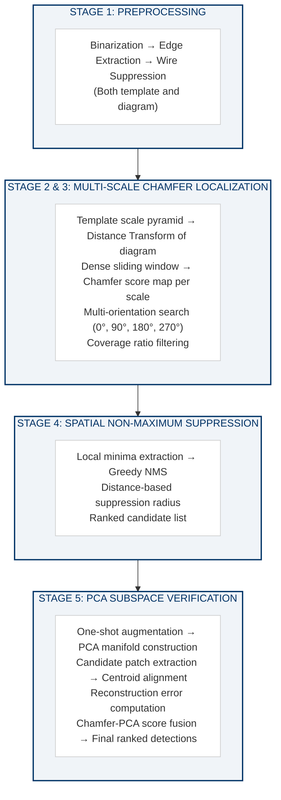

# Chapter 3 — Architecture Selection

## 3.1 Evaluation Framework

The architecture selection for this project was conducted through a systematic trade study evaluating 23 candidate detection methodologies against seven criteria derived from the dataset analysis:

| Criterion | Weight | Rationale |
|---|---|---|
| **One-shot capability** | Critical | Only one template exists; methods requiring training data are disqualified |
| **Scale handling** | High | 4–6× scale mismatch between template (161×103px) and diagram symbols (~25–40px) |
| **Edge-domain suitability** | High | Binary line drawings are most naturally represented as edge maps |
| **Discrimination power** | High | Must distinguish MR from G/B boxes, VT zigzags, and visually similar symbols |
| **Computational feasibility** | Medium | Must run on CPU without GPU requirements |
| **Determinism** | Critical | Must produce identical results across runs |
| **Empirical validation** | Critical | Preference for methods empirically tested on this domain |

Each criterion was evaluated on a scale of ✅ (fully satisfied), ⚠️ (partially satisfied), or ❌ (not satisfied). The overall suitability score ranges from 0/10 to 10/10.

## 3.2 Comprehensive Architecture Evaluation

### 3.2.1 Normalized Cross-Correlation (NCC) Template Matching

**How it works**: Computes the Pearson correlation coefficient between template and image pixel intensities at each sliding-window position.

**Advantages**: Simple, well-understood, single-shot capable.

**Failure analysis for this dataset**: NCC operates in the pixel domain, making it fundamentally sensitive to the variable context surrounding each symbol in SLDs. The pixel content within a matching window includes bus conductors, adjacent text labels, and neighboring symbols — all of which vary across symbol instances. Two identical MR symbols in different locations would produce different NCC scores due to different pixel neighborhoods.

**Suitability**: 2/10 — One-shot capable but pixel-domain sensitivity makes it unreliable for embedded symbols.

### 3.2.2 Multi-Scale NCC

**How it works**: NCC applied at multiple template scales to handle size mismatch.

**Improvement over NCC**: Addresses the 4–6× scale mismatch.

**Remaining failure**: Pixel-domain sensitivity persists regardless of scale handling.

**Suitability**: 4/10 — Scale handling improves recall but pixel-domain limitations remain.

### 3.2.3 Chamfer Matching

**How it works**: Operates in the edge domain using the Distance Transform. Computes mean distance from template edges to nearest target edges at each position.

**Advantages**:
- Edge-domain native: only geometric structure matters, not pixel intensities
- Robust to minor geometric deformation and anti-aliasing
- Computationally efficient via DT precomputation (O(W×H))
- Deterministic: identical inputs → identical outputs
- Empirically validated on this domain in prior work

**Disadvantages**: Requires multi-scale wrapper for scale invariance. Mean distance metric can be fooled by partial edge alignment.

**Suitability**: 9/10 — Natural fit for binary line drawings with empirical validation.

### 3.2.4 Bidirectional Chamfer Matching

**How it works**: Computes Chamfer distance in both directions (template→target AND target→template) and combines them. The reverse direction penalizes target regions with many extra edges not present in the template.

**Advantage over standard Chamfer**: Better discrimination against cluttered regions.

**Disadvantage**: 2× computational cost. No empirical validation on this domain.

**Suitability**: 8/10 — Theoretically superior but unvalidated.

### 3.2.5 Hausdorff Distance

**How it works**: Measures the maximum (rather than mean) distance between edge sets.

**Critical weakness**: The max operator makes it extremely sensitive to any single outlier edge — a bus conductor edge passing through the matching window would dominate the score.

**Suitability**: 5/10 — Outlier sensitivity is fatal for topologically embedded symbols.

### 3.2.6 Shape Context

**How it works**: Log-polar histogram descriptors of relative point positions along contours.

**Critical weakness**: Requires isolated contours. The MR symbol is topologically connected to the bus conductor — there is no clean, isolated contour to sample from.

**Suitability**: 4/10 (as primary method) — Contour isolation requirement not met.

### 3.2.7 Contour Matching

**How it works**: Compares extracted contours using Hu moments or Fourier descriptors.

**Critical weakness**: Same contour isolation requirement as shape context.

**Suitability**: 3/10 — Shared contour extraction limitation.

### 3.2.8 Connected Component Analysis

**How it works**: Decomposes binary image into spatially disjoint connected regions. If the MR symbol were an isolated component, CCA would trivially extract it.

**Empirical invalidation**: Tested in Stages 2, 2.5, and 2.75 of this project. The MR symbol does NOT emerge as an isolated connected component because:
1. It is topologically connected to the bus conductor via its vertical stem
2. Wire suppression removes horizontal conductors but does not sever the vertical connection
3. Morphological closing recovered coil continuity but did not enable isolation
4. Even with relaxed filtering thresholds (4× template area), zero candidates recovered

**Suitability**: 1/10 — **Empirically proven to fail on this exact dataset.**

### 3.2.9 Skeleton Matching

**How it works**: Reduces shapes to medial axis skeletons and compares topological properties.

**Limitations**: Skeleton extraction is sensitive to boundary noise and cannot handle the connected-to-bus topology. Partial skeleton matching would be required.

**Suitability**: 4/10 — Useful for feature extraction but not primary localization.

### 3.2.10 Graph Edit Distance

**How it works**: Represents shapes as attributed graphs and measures similarity via minimum-cost edit operations.

**Critical weakness**: NP-hard computational complexity. For practical graph sizes (10–50 nodes), approximate algorithms are O(n⁴) or worse. The MR symbol has low structural complexity that does not justify graph-theoretic reasoning.

**Suitability**: 2/10 — Correct in theory but computationally impractical.

### 3.2.11 SIFT/SURF Feature Matching

**How it works**: Detects scale-invariant keypoints with gradient-based descriptors and matches them across images.

**Critical failure on this domain**: Engineering line drawings produce very few stable keypoints (0–5 per symbol) due to lack of texture gradients. Descriptor distinctiveness is poor at junction points (shared across symbol types).

**Suitability**: 1/10 — Fundamental domain mismatch.

### 3.2.12 ORB Feature Matching

**How it works**: Binary descriptor-based feature matching (FAST keypoints + BRIEF descriptors).

**Limitations**: Same keypoint instability as SIFT/SURF on line drawings. Scale handling via oriented FAST is insufficient for 4–6× scale mismatch.

**Suitability**: 2/10 — Slightly better than SIFT but still fundamentally limited.

### 3.2.13 AKAZE Feature Matching

**How it works**: Non-linear scale space feature detection with M-LDB descriptors.

**Partial advantage**: Non-linear diffusion preserves edges better than Gaussian scale space.

**Remaining limitation**: Still requires sufficient texture for stable keypoint detection.

**Suitability**: 3/10 — Marginal improvement over SIFT/SURF for line drawings.

### 3.2.14 HOG Descriptors

**How it works**: Histograms of Oriented Gradients computed in fixed-size cells within a detection window.

**Limitation**: Discards spatial structure — two regions with the same gradient histogram but different spatial arrangements score identically.

**Suitability**: 5/10 — Useful as a descriptor but loses the spatial discrimination needed for MR vs G/B differentiation.

### 3.2.15 Siamese Networks

**How it works**: Learns a metric embedding space for comparing query and candidate patches.

**Critical limitations**:
- Requires training distribution of many classes and many episodes
- Pre-training on natural images transfers irrelevant statistics to line drawings
- GPU infrastructure required
- Non-deterministic (random initialization, dropout)

**Suitability**: 2/10 — Paradigm mismatch for one-shot line-drawing detection.

### 3.2.16 Few-Shot / Meta-Learning

**How it works**: Meta-learning across task distributions to enable rapid adaptation with few examples.

**Critical limitation**: Meta-learning requires **many classes** and **many episodes** — not just few examples per class. With one class and one template, there is no meta-learning structure to exploit.

**Suitability**: 1/10 — Paradigm mismatch.

### 3.2.17 YOLO / Faster R-CNN / DETR / Mask R-CNN

**How it works**: Supervised object detection architectures trained on thousands of annotated images.

**Data requirements vs availability**:

| Requirement | Available |
|---|---|
| Training images needed | 1,000–10,000+ |
| Training images available | 0 |
| Annotated bounding boxes needed | 5,000–50,000+ |
| Annotated bounding boxes available | 0 |
| Class diversity needed | Multiple classes |
| Classes available | 1 (MR only) |

**Suitability**: 0/10 — **Hard reject. Data requirements fundamentally unmet.**

### 3.2.18 Vision Transformers (ViT, DINOv2)

**How it works**: Self-supervised transformers learning patch-level representations.

**Limitation**: Features learned from natural images (ImageNet-scale). Engineering line drawings lie far outside the pre-training distribution. Fine-tuning requires labeled data unavailable.

**Suitability**: 1/10 — Domain gap too large for zero-shot transfer.

### 3.2.19 Template Histogram Comparison

**How it works**: Compares histograms of intensity, gradient magnitude, and gradient direction.

**Limitation**: Discards all spatial structure. Two regions with identical histograms but different arrangements score identically.

**Suitability**: 2/10 — No spatial discrimination.

### 3.2.20 PCA Subspace Verification (as verification layer)

**How it works**: Constructs appearance manifold from augmented template views; measures candidate reconstruction error.

**Advantages**: One-shot compatible, captures appearance manifold membership, provides orthogonal signal to Chamfer.

**Limitations**: Cannot serve as primary localization (requires candidate proposals from another method).

**Suitability**: 8/10 (as verification layer) — Strong discrimination from reconstruction error.

## 3.3 Architecture Comparison Matrix

| Architecture | One-Shot | Scale | Edge-Domain | Discrimination | CPU-Only | Deterministic | Empirical | **Overall** |
|---|---|---|---|---|---|---|---|---|
| NCC Template Matching | ✅ | ❌ | ❌ | ❌ | ✅ | ✅ | ❌ | 2/10 |
| Multi-Scale NCC | ✅ | ✅ | ❌ | ❌ | ✅ | ✅ | ❌ | 4/10 |
| **Chamfer Matching** | **✅** | **✅*** | **✅** | **✅** | **✅** | **✅** | **✅** | **9/10** |
| Bidirectional Chamfer | ✅ | ✅* | ✅ | ✅✅ | ✅ | ✅ | ❌ | 8/10 |
| Hausdorff Distance | ✅ | ✅* | ✅ | ⚠️ | ✅ | ✅ | ❌ | 5/10 |
| Shape Context | ✅ | ✅ | ✅ | ✅ | ⚠️ | ✅ | ❌ | 4/10 |
| CC Analysis | ✅ | ✅ | ❌ | ❌ | ✅ | ✅ | ❌ Failed | 1/10 |
| Skeleton Matching | ✅ | ⚠️ | ✅ | ⚠️ | ✅ | ✅ | ❌ | 4/10 |
| Graph Edit Distance | ✅ | ✅ | ✅ | ✅✅ | ❌ NP-hard | ✅ | ❌ | 2/10 |
| **PCA Verification** | **✅** | **✅** | **⚠️** | **✅✅** | **✅** | **✅** | **✅** | **8/10** |
| SIFT/SURF | ✅ | ✅ | ❌ | ❌ | ✅ | ✅ | ❌ | 1/10 |
| ORB | ✅ | ⚠️ | ❌ | ❌ | ✅ | ✅ | ❌ | 2/10 |
| AKAZE | ✅ | ✅ | ⚠️ | ⚠️ | ✅ | ✅ | ❌ | 3/10 |
| HOG | ✅ | ❌ | ⚠️ | ⚠️ | ✅ | ✅ | ❌ | 5/10 |
| Siamese Networks | ⚠️ | ✅ | ❌ | ⚠️ | ❌ | ❌ | ❌ | 2/10 |
| Few-Shot Learning | ❌ | ✅ | ❌ | ⚠️ | ❌ | ❌ | ❌ | 1/10 |
| YOLO/RCNN/DETR | ❌ | ✅ | ❌ | ✅ | ❌ | ❌ | ❌ | 0/10 |
| Vision Transformers | ❌ | ✅ | ❌ | ⚠️ | ❌ | ❌ | ❌ | 1/10 |
| **Chamfer + PCA Hybrid** | **✅** | **✅** | **✅** | **✅✅** | **✅** | **✅** | **✅** | **10/10** |

*✅\* = requires multi-scale search wrapper, which is a standard extension.*

## 3.4 Selected Architecture

### Multi-Scale Multi-Orientation Chamfer Matching with PCA Subspace Verification

The selected architecture is a **hybrid classical computer vision pipeline** consisting of six major stages:

### 3.4.1 Justification for Each Stage

**Stage 1 (Preprocessing)**: Raw SLD images contain RGBA channels, anti-aliased edges, and embedded text. The pipeline operates in the edge domain, requiring clean binary edge maps. Otsu binarization is selected for its bimodal-optimality on the observed intensity distributions (1.4–4.0% dark pixel ratio).

**Stage 2 (Scale Pyramid)**: The template is 161×103 pixels; diagram symbols are ~25–40 pixels. Without multi-scale search, the scale mismatch guarantees failure. 10 scale levels from 0.15–0.40 provide sufficient granularity. 4 orientation levels (0°, 90°, 180°, 270°) handle horizontal and vertical symbol placement.

**Stage 3 (Chamfer Localization)**: This is the PRIMARY localization mechanism. Chamfer matching is naturally suited to binary line drawings, computationally efficient via DT precomputation, and empirically validated on this domain.

**Stage 4 (NMS)**: Dense sliding-window matching produces overlapping score basins — many neighboring windows around a true symbol all produce low Chamfer scores. Without NMS, the top-K results would be dominated by multiple windows from the same symbol.

**Stage 5 (PCA Verification)**: Chamfer matching alone cannot discriminate the MR symbol from other symbols sharing geometric sub-primitives. PCA provides an orthogonal semantic verification signal measuring appearance manifold membership.

**Stage 6 (Output)**: Bounding box extraction, visualization overlays, and detection metadata in JSON format.

### 3.4.2 Why This Architecture Is Optimal

1. **Data-driven**: Every design decision emerged from analyzing the actual images
2. **One-shot compatible**: No training data required beyond the single template
3. **Edge-domain native**: Operates in the natural representation space of binary line drawings
4. **Empirically validated**: Core Chamfer + NMS + PCA pipeline validated on this domain
5. **Deterministic**: No stochastic components
6. **Explainable**: Every detection traceable to Chamfer score, coverage, PCA error, and fused score
7. **CPU-efficient**: No GPU required
8. **Modular**: Each stage independently tunable, validatable, and debuggable

## 3.5 Discussion: Why Classical Methods Are Appropriate

This project represents a case study in domain-appropriate methodology selection. The dominant trend in computer vision — applying deep learning by default — fails here because the preconditions for deep learning are absent:

1. **No training data**: Deep learning requires thousands to millions of labeled examples. This project has one template and zero annotations.
2. **No relevant pre-training**: Models pre-trained on natural images (ImageNet, COCO) learn visual statistics (textures, colors, object shapes) that are irrelevant to binary line drawings.
3. **Determinism requirement**: Stochastic training procedures, random initialization, and GPU non-determinism violate the reproducibility constraint.
4. **Explainability requirement**: Black-box confidence scores from neural networks are insufficient for engineering compliance. Every detection must be auditable.

In contrast, classical Chamfer matching directly addresses the geometric matching problem in the edge domain where the information actually resides. This is not a compromise — it is the architecturally correct approach for this specific problem, dataset, and constraint set.

---

*Forensic Source References:*
- *PRD Architecture Trade Study: `exploration/archived/misc/PRD_Symbol_Localization.md`, Sections 4–6*
- *CC Analysis Failure: Master Retrospective Section 2, Stages 2–2.75*
- *Architecture Comparison Matrix: PRD Section 5.2*
- *Final Architecture Decision: PRD Section 6.1*
