# Chapter 4 — Pipeline Design

## 4.1 Pipeline Overview

The complete symbol localization pipeline consists of six sequential stages, each consuming the outputs of the previous stage and producing structured artifacts for downstream consumption:

```mermaid
flowchart LR
    IN["Inputs: MR_Symbol.png + SLD{1,2,3,4,7,8,9,10,11,12}.png"]
    
    subgraph S1 [STAGE 1: PREPROCESSING]
        direction TB
        p1["1a. Template Preprocessing<br/>1b. Diagram Preprocessing<br/>1c. Wire Suppression"]
    end
    
    subgraph S2 [STAGE 2: SCALE & ORIENTATION PYRAMID]
        direction TB
        p2["2a. Template Scale Pyramid<br/>2b. Orientation Variants (0/90/180/270°)<br/>2c. Method D3 Rasterization"]
    end
    
    subgraph S3 [STAGE 3: CHAMFER LOCALIZATION]
        direction TB
        p3["3a. Distance Transform<br/>3b. Dense Sliding Window Search<br/>3c. Score Map Aggregation<br/>3d. Coverage Ratio Filtering"]
    end
    
    subgraph S4 [STAGE 4: COVERAGE RESCORING]
        direction TB
        p4["4a. Coverage Recomputation<br/>4b. Area-Normalized Scoring<br/>4c. Multi-Ranking Export"]
    end
    
    subgraph S5 [STAGE 5: STRUCTURAL VERIFICATION]
        direction TB
        p5["5a. Topological Feature Extraction<br/>5b. Structural Scoring<br/>5c. Combined Score Ranking"]
    end
    
    subgraph S6 [STAGE 6: OUTPUT GENERATION]
        direction TB
        p6["6a. NMS + Thresholding<br/>6b. Bounding Box Extraction<br/>6c. Visualization & Metadata (JSON)"]
    end
    
    OUT["Outputs: Bounding boxes + Annotated SLDs + Detection metadata"]

    IN --> S1 --> S2 --> S3 --> S4 --> S5 --> S6 --> OUT
    
    style IN fill:#e6f2ff,stroke:#0059b3,stroke-width:2px,color:#003366
    style OUT fill:#e6f2ff,stroke:#0059b3,stroke-width:2px,color:#003366
    style S1 fill:#f0f4f8,stroke:#003366,stroke-width:2px,color:#003366
    style S2 fill:#f0f4f8,stroke:#003366,stroke-width:2px,color:#003366
    style S3 fill:#f0f4f8,stroke:#003366,stroke-width:2px,color:#003366
    style S4 fill:#f0f4f8,stroke:#003366,stroke-width:2px,color:#003366
    style S5 fill:#f0f4f8,stroke:#003366,stroke-width:2px,color:#003366
    style S6 fill:#f0f4f8,stroke:#003366,stroke-width:2px,color:#003366
    style p1 fill:#ffffff,stroke:#cccccc,stroke-width:1px
    style p2 fill:#ffffff,stroke:#cccccc,stroke-width:1px
    style p3 fill:#ffffff,stroke:#cccccc,stroke-width:1px
    style p4 fill:#ffffff,stroke:#cccccc,stroke-width:1px
    style p5 fill:#ffffff,stroke:#cccccc,stroke-width:1px
    style p6 fill:#ffffff,stroke:#cccccc,stroke-width:1px
```

<div class="landscape-diagram-container" markdown="1">
<div class="landscape-diagram" markdown="1">



</div>
</div>

## 4.2 Stage 1: Preprocessing

### 4.2.1 Template Preprocessing (Stage 1a)

**Purpose**: Convert the raw template image into clean binary and edge representations suitable for Chamfer matching.

**Input**: `MR_Symbol.png` (161×103, RGBA, grayscale content)

**Processing Pipeline**:
1. **Image Loading**: Load RGBA image with format validation and dimension verification.
2. **Grayscale Conversion**: Convert to single-channel grayscale: `gray = 0.299R + 0.587G + 0.114B`
3. **Denoising**: Apply median filter (kernel_size=3) to smooth anti-aliasing artifacts without destroying edge structure. Median filtering is preferred over Gaussian because it preserves edge sharpness while removing salt-and-pepper noise.
4. **Binarization**: Apply Otsu's thresholding to produce binary mask (0/255). Otsu is selected because the intensity histogram is strongly bimodal (white background + black strokes), making the automatic threshold extremely robust. The observed bimodal distribution (dark pixel ratio 1.4–4.0%) guarantees Otsu's optimal behavior.
5. **Edge Detection**: Apply Canny edge detection (low=50, high=150) on the denoised grayscale image. Canny operates on the continuous intensity gradients rather than the binary image to capture sub-pixel edge localization from the anti-aliased original.

**Output Artifacts**:
- `template/gray.png` — grayscale image
- `template/binary.png` — binarized template  
- `template/edges.png` — Canny edge map

**Complexity**: O(W×H) — single-pass per operation.

**Implementation Reference**: `src/pipeline/pipeline.py`, `run_preprocessing_stage()` function.

### 4.2.2 Diagram Preprocessing (Stage 1b)

**Purpose**: Convert each SLD into clean binary and edge representations.

**Input**: `SLD{N}.png` (variable size, RGBA)

**Processing**: Identical pipeline to template preprocessing, applied independently per-SLD.

**Key Parameter Consistency**: The adaptive threshold parameters must be consistent across all SLDs to ensure uniform binarization. Since all SLDs exhibit similar dark pixel ratios (1.4–4.0%), a single Otsu-based parameter set generalizes across the corpus.

**Output Artifacts** (per SLD):
- `diagrams/{SLD_name}/gray.png`
- `diagrams/{SLD_name}/binary.png`
- `diagrams/{SLD_name}/edges.png`

### 4.2.3 Wire Suppression (Stage 1c)

**Purpose**: Suppress long horizontal conductor lines to reduce edge clutter and improve Chamfer matching precision.

**Algorithm**:
1. Create horizontal structuring element: `kernel = np.ones((1, W_wire), dtype=np.uint8)` where W_wire ≈ 50–100 pixels
2. Apply morphological opening: `wire_mask = cv2.morphologyEx(binary, MORPH_OPEN, kernel)`
3. Subtract wire mask: `no_wire = binary - wire_mask`
4. Re-extract edges from wire-suppressed image

**Mathematical Justification**: Morphological opening with a wide horizontal kernel preserves only structures that are at least W_wire pixels wide horizontally — i.e., bus conductors. Subtracting this mask removes conductors while preserving symbols, which are narrower than W_wire.

**Failure Modes and Mitigation**:
- W_wire too small → incomplete conductor suppression → mitigated by setting W_wire ≥ 50px
- W_wire too large → may suppress wide horizontal text or symbol elements → mitigated by applying only to diagrams (not template)
- Wire suppression severs the MR symbol's vertical stem connection → confirmed during Stage 2.75 empirical testing

## 4.3 Stage 2: Scale and Orientation Pyramid

### 4.3.1 Scale Pyramid Generation (Stage 2a)

**Purpose**: Generate multiple scaled versions of the template edge map to handle the 4–6× scale mismatch.

**Input**: Template edge map (161×103 pixels)

**Parameters** (from `config/template_bank.yaml`):
- `scale_min`: 0.15
- `scale_max`: 0.40
- `num_scales`: 10
- `scale_spacing_strategy`: "linear"

**Scale Levels**: `scales = np.linspace(0.15, 0.40, 10)` = [0.150, 0.178, 0.206, 0.233, 0.261, 0.289, 0.317, 0.344, 0.372, 0.400]

**Output Template Dimensions** (approximate):
| Scale | Width (px) | Height (px) | Template Area |
|---|---|---|---|
| 0.150 | 24 | 15 | 360 |
| 0.178 | 29 | 18 | 522 |
| 0.206 | 33 | 21 | 693 |
| 0.233 | 38 | 24 | 912 |
| 0.261 | 42 | 27 | 1,134 |
| 0.289 | 47 | 30 | 1,410 |
| 0.317 | 51 | 33 | 1,683 |
| 0.344 | 55 | 35 | 1,925 |
| 0.372 | 60 | 38 | 2,280 |
| 0.400 | 64 | 41 | 2,624 |

### 4.3.2 Method D3: Coordinate Scaling + Anti-Aliased Rasterization

**Critical Context**: The original template generation method (Method A: `cv2.resize` + threshold at 127) produced **completely empty templates** at scales ≤ 0.20 due to edge intensity dilution during downsampling. At scale 0.15, Method A produced 0 edge pixels — a 100% structural loss. This catastrophic failure, discovered during Stage 2, required the development and validation of Method D3.

**Algorithm** (`generate_d3_template()` in `src/pipeline/pyramid.py`):

1. Extract all edge pixel coordinates from the high-resolution template: `edge_pixels = np.argwhere(rotated_base > 0)`
2. Identify 8-connectivity adjacent pixel pairs in the high-res template
3. Create an 8× oversampled canvas: `canvas = np.zeros((h_s * 8, w_s * 8), dtype=np.uint8)`
4. Scale coordinates to subpixel space: `scaled_pixels = edge_pixels * scale_factor * 8`
5. Rasterize connections between adjacent scaled points using `cv2.line()` on the oversampled canvas
6. Downsample canvas to target resolution using `cv2.resize()` with `INTER_AREA` interpolation
7. Threshold result at intensity 25 to produce final binary edge map

**Why Method D3 succeeds**: Instead of downsampling pixel intensities (which dilutes thin edges), D3 preserves the **topological connectivity** of the original template by rasterizing continuous line segments between scaled coordinate points. The 8× oversampling provides sub-pixel precision, and the INTER_AREA downsampling with low threshold (25) preserves even faint edge fragments.

**Measured Performance**: Method D3 produces 102 edge pixels at scale 0.15 with 1.00 edge continuity, compared to Method A's 0 edge pixels.

### 4.3.3 Orientation Variants (Stage 2b)

**Purpose**: Handle 90° rotated symbols (observed in SLD11).

**Orientations**: [0°, 90°, 180°, 270°]

**Implementation**: For each orientation, rotate the high-resolution base template first using `cv2.warpAffine` with bound expansion (`rotate_bound()`), then apply Method D3 coordinate scaling.

**Total Template Variants**: 10 scales × 4 orientations = **40 templates**

**Manifest**: All 40 templates catalogued in `outputs/template_bank/template_bank_manifest.csv` with structural metadata (edge_count, component_count, contour_count, edge_density, edge_continuity).

## 4.4 Stage 3: Dense Chamfer Localization

### 4.4.1 Distance Transform Precomputation (Stage 3a)

**Purpose**: Precompute the Euclidean Distance Transform of each diagram edge map, enabling O(1) distance lookup per template edge pixel.

**Algorithm**:
1. Invert edges: `inv_edges = 255 - diagram_edges`
2. Compute DT: `DT = cv2.distanceTransform(inv_edges, cv2.DIST_L2, 5)`

**Mathematical Definition**: `DT(x,y) = min_{(x',y') ∈ E} ||(x,y) - (x',y')||₂` where E is the set of diagram edge pixels.

**Properties**: DT(x,y) = 0 at edge pixels and increases smoothly away from edges, creating a smooth scoring landscape for Chamfer matching.

**Output**: Per-SLD distance transform saved as `outputs/distance_transforms/{SLD}_dt.tiff` (TIFF for float32 precision).

### 4.4.2 Dense Sliding Window Search (Stage 3b)

**Purpose**: Exhaustively evaluate the Chamfer distance at every valid translation position across all template variants.

**Implementation** (`src/template_matching/chamfer_matching.py`):

The production implementation uses `cv2.filter2D` for efficient convolution-based Chamfer scoring:

```python
# For each template variant, create a binary template image
# and convolve it with the DT using filter2D
score_map = cv2.filter2D(dt_image, -1, template_kernel)
```

This is mathematically equivalent to the naïve sliding-window sum but exploits FFT-based convolution for O(W×H × log(W×H)) complexity instead of O(W×H × |E_template|).

**Coverage Ratio Computation**: Simultaneously, the coverage ratio at each position is computed as the fraction of template edge pixels within distance τ=2.0 of a diagram edge:

$$\text{Coverage}(x, y) = \frac{\sum_{(e_x, e_y) \in E_T} \mathbb{1}[DT(y + e_y, x + e_x) \leq 2.0]}{|E_T|}$$

### 4.4.3 Score Map Aggregation (Stage 3c)

For each position, the best-scoring template variant (minimum mean Chamfer distance, subject to minimum coverage) is retained:

```
For each (x, y):
    best_score = inf
    for each variant v:
        if coverage_map_v[y, x] >= 0.65 and score_map_v[y, x] < best_score:
            best_score = score_map_v[y, x]
            best_scale = v.scale
            best_orientation = v.orientation
```

### 4.4.4 Candidate Extraction

Local minima in the best score map are extracted as candidate detection positions. The `scipy.ndimage.minimum_filter` with window size 15×15 identifies positions where the score is a local minimum within a 15-pixel radius.

**Output**: Raw candidate list with (x, y, chamfer_score, coverage_ratio, scale, orientation) per candidate. Total across all SLDs: **264,852 raw candidates** in the production run.

## 4.5 Stage 4: Coverage Rescoring

### 4.5.1 Purpose and Motivation

After Stage 3, true MR symbols exist in the candidate pool but their ranks are catastrophically poor — median rank ~20,000 out of 264,852. The dominant failure mode is **small-template bias**: templates at scales 0.150–0.178 produce artificially low Chamfer scores because their few edge pixels trivially align with text strokes and conductor fragments.

### 4.5.2 Rescoring Formulae

Three normalized scoring formulas were developed and evaluated (`src/verification/coverage_rescoring.py`):

1. **Score A** (Coverage × Scale): `normalized_score_a = coverage_r1 × scale`
   - Rationale: Penalizes small-scale matches by multiplying coverage by scale factor

2. **Score B** (Coverage × Area): `normalized_score_b = coverage_r1 × template_area`
   - Rationale: Stronger penalization — template area grows quadratically with scale

3. **Score C** (Coverage × Scale × Density): `normalized_score_c = coverage_r1 × scale × edge_density`
   - Rationale: Additional penalization for low-density templates (conditional on Stage 3.6 validation)

### 4.5.3 Coverage Ratio Tolerance Analysis

Coverage is computed at four distance tolerances:
- **Coverage R0** (τ=0.05px): Exact edge alignment — fraction of template edges directly on diagram edges
- **Coverage R1** (τ=1.05px): 1-pixel tolerance — standard operational metric
- **Coverage R2** (τ=2.05px): 2-pixel tolerance — relaxed matching
- **Coverage R3** (τ=3.05px): 3-pixel tolerance — very relaxed matching

**Key Finding**: Coverage R1 is used as the primary metric because it provides the best trade-off between discriminative power and noise tolerance.

### 4.5.4 Candidate Survival Audit

A strict survival audit verifies that Stage 4 functions purely as a rescoring layer without accidentally filtering candidates:
- **Candidates In**: 264,852
- **Candidates Out**: 264,852
- **Loss Factor**: 0%
- **Status**: PASSED — No candidates were removed, suppressed, or merged

### 4.5.5 Output Artifacts

Four ranked CSV files produced:
- `rescored_candidates.csv` — Full dataset with new scores
- `ranked_by_coverage_scale.csv` — Ranked by Score A
- `ranked_by_coverage_area.csv` — Ranked by Score B (used by Stage 5)
- `ranked_by_combined.csv` — Ranked by Score C (if validated)

## 4.6 Stage 5: Structural Verification

### 4.6.1 Budget Management

Stage 5 operates on a **budgeted subset** of candidates to manage computational cost. The budget strategy is configurable via `config/stage5_verification.yaml`:
- **Strategy**: `PER_SLD_TOP_N` or `GLOBAL_TOP_N`
- **Limit**: 1,000 candidates per SLD (10,000 total)

### 4.6.2 Structural Feature Extraction

For each budgeted candidate, 25+ structural features are computed by comparing the candidate patch against the matched template (`src/verification/structural_verification.py`):

**Group A — Component Features**:
- `component_count`: Number of connected components (cv2.connectedComponents)
- `component_difference`: |candidate_cc - template_cc|
- `largest_component_ratio`: Ratio of largest CC area to total area

**Group B — Contour Features**:
- `contour_count`, `contour_difference`
- `contour_area_ratio`, `contour_perimeter_ratio`

**Group C — Geometry Features**:
- `aspect_ratio_difference`
- `bbox_area_ratio`

**Group D — Density Features**:
- `edge_density_difference` (foreground pixels / total area)

**Group E — Occupancy Features**:
- `occupancy_difference` (foreground pixels / bounding box area)

**Group F — Topology Features**:
- `euler_difference` (Euler number = components - holes)
- `hole_count_difference`
- `topology_difference` (euler_diff + hole_diff)

**Group G — Similarity Features**:
- `edge_overlap_ratio` (intersection of candidate and template edge pixels)
- `shape_similarity` (cv2.matchShapes using Hu moments)
- `localized_chamfer_residual` (Chamfer distance recomputed at candidate location)

### 4.6.3 Verification Score Computation

Each difference metric is transformed to a [0, 1] similarity score and combined via configurable weights:

```python
s_comp = max(0, 1.0 - component_difference * 0.1)
s_cont = max(0, 1.0 - contour_difference * 0.1)
s_geom = max(0, 1.0 - aspect_ratio_difference)
s_dens = max(0, 1.0 - density_difference * 2.0)
s_occ  = max(0, 1.0 - occupancy_difference * 2.0)
s_topo = max(0, 1.0 - topology_difference * 0.2)
s_sim  = edge_overlap_ratio

VerificationScore = Σ(weight_i × s_i)
```

### 4.6.4 Combined Score

The final combined score blends the verification score with the coverage-area score:

```python
CombinedScore = verification_weight × VerificationScore + 
                coverage_area_weight × CoverageAreaScore
```

### 4.6.5 Output Artifacts

Three ranked datasets:
- `verified_candidates.csv` — Full structural profiles
- `ranked_by_verification.csv` — Ranked by VerificationScore
- `ranked_by_combined_score.csv` — Ranked by CombinedScore (primary ranking)

## 4.7 Stage 6: Output Generation (Unreached)

Stage 6 was designed to perform final NMS, thresholding, bounding box extraction, and output generation. **This stage has never been executed** because the ranking quality from Stage 5 never passed the Stage 6 readiness gate.

The intended Stage 6 processing:
1. Apply greedy NMS with IoU threshold to suppress spatial duplicates
2. Apply confidence threshold on CombinedScore
3. Extract bounding boxes: `bbox = (x, y, template_width × scale, template_height × scale)`
4. Generate annotated SLD overlays with detection boxes
5. Export detection metadata as JSON

The Stage 6 readiness criteria:
- Criterion A: Top-100 hit rate improvement
- Criterion B: Median rank improvement  
- Criterion C: Ranking inversions decrease
- Criterion D: Regime D (small symbol) improvement
- Criteria E–I: Stability, no degradation, no suppression, no deletion, no detector modification
- Criterion J: Beats BASE experiment

**Result**: Both gate evaluations (Stage 5.6 and Stage 5.9) returned **NOT READY FOR STAGE 6**.

## 4.8 Data Flow Summary

```mermaid
flowchart LR
    T_IN["MR_Symbol.png"] --> P_T["PREPROCESS"] --> T_EDGE["template edges"] --> SP["SCALE PYRAMID"] --> T_VAR["40 template variants"]
    
    D_IN["SLD{N}.png"] --> P_D["PREPROCESS"] --> D_EDGE["diagram edges"] --> DT["DISTANCE TRANSFORM"] --> DT_OUT["distance_transform"]
    
    T_VAR --> CM["CHAMFER MATCH"]
    DT_OUT --> CM
    
    CM --> SM["score_maps (40)"] --> AGG["AGGREGATE + FILTER"] --> CAND["264,852 candidates"] --> CR["COVERAGE RESCORE"] --> RESC["rescored_candidates"] --> SV["STRUCTURAL VERIFY (budget: 10,000)"] --> CS["combined_score ranking"] --> S6["STAGE 6: NOT REACHED"]

    style T_IN fill:#e6f2ff,stroke:#0059b3,stroke-width:2px,color:#003366
    style D_IN fill:#e6f2ff,stroke:#0059b3,stroke-width:2px,color:#003366
    style P_T fill:#f0f4f8,stroke:#003366,stroke-width:2px,color:#003366
    style P_D fill:#f0f4f8,stroke:#003366,stroke-width:2px,color:#003366
    style SP fill:#f0f4f8,stroke:#003366,stroke-width:2px,color:#003366
    style DT fill:#f0f4f8,stroke:#003366,stroke-width:2px,color:#003366
    style CM fill:#f0f4f8,stroke:#003366,stroke-width:2px,color:#003366
    style AGG fill:#f0f4f8,stroke:#003366,stroke-width:2px,color:#003366
    style CR fill:#f0f4f8,stroke:#003366,stroke-width:2px,color:#003366
    style SV fill:#f0f4f8,stroke:#003366,stroke-width:2px,color:#003366
    style S6 fill:#ffe6e6,stroke:#cc0000,stroke-width:2px,color:#cc0000
    style T_EDGE fill:#ffffff,stroke:#cccccc,stroke-width:1px
    style T_VAR fill:#ffffff,stroke:#cccccc,stroke-width:1px
    style D_EDGE fill:#ffffff,stroke:#cccccc,stroke-width:1px
    style DT_OUT fill:#ffffff,stroke:#cccccc,stroke-width:1px
    style SM fill:#ffffff,stroke:#cccccc,stroke-width:1px
    style CAND fill:#ffffff,stroke:#cccccc,stroke-width:1px
    style RESC fill:#ffffff,stroke:#cccccc,stroke-width:1px
    style CS fill:#ffffff,stroke:#cccccc,stroke-width:1px
```

<div class="landscape-diagram-container" markdown="1">
<div class="landscape-diagram" markdown="1">



</div>
</div>

---

*Forensic Source References:*
- *Pipeline orchestration: `src/pipeline/pipeline.py`*
- *Template bank generation: `src/pipeline/pyramid.py`*
- *Chamfer matching: `src/template_matching/chamfer_matching.py`*
- *Coverage rescoring: `src/verification/coverage_rescoring.py`*
- *Structural verification: `src/verification/structural_verification.py`*
- *Configuration: `config/preprocessing.yaml`, `config/template_bank.yaml`, `config/stage5_verification.yaml`*
- *PRD Pipeline Design: `exploration/archived/misc/PRD_Symbol_Localization.md`, Section 7*
