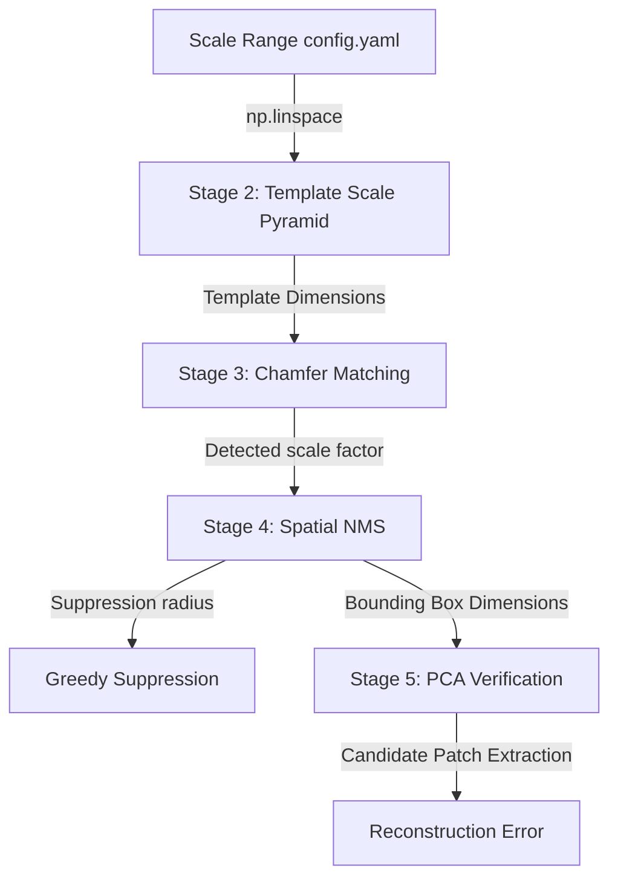

# PRD Scale Range Architectural Dependency Analysis

This report analyzes the downstream dependencies of the scale range within the Symbol Localization System. It determines the architectural impact if the lower scales (specifically, the degenerate scales 0.150–0.206) were removed from the search space.

---

## 1. Summary of Dependencies

The scale parameter is a core vertical thread in the pipeline. It is initialized in Stage 2 (Template Scale Pyramid) and propagates through matching, filtering, spatial consolidation, and verification.

---

## 2. Component-by-Component Dependency Analysis

### A. Stage 2 & 3: Template Generation and Chamfer Matching
* **Architectural Link**: The template scale factor $s$ directly determines the dimensions of the scaled template edge map ($W_{\text{scaled}} = 161 \cdot s$, $H_{\text{scaled}} = 103 \cdot s$). The sliding window matching complexity is linear with respect to the number of scale steps ($N_{\text{scales}}$).
* **Impact of Removing Lower Scales**:
  - **Computational Efficiency**: Removing scales below 0.206 (e.g., leaving only 7 out of 10 scales, or shifting the range) will reduce the search space. Since Chamfer matching scales linearly with the number of template variants, this results in a proportional runtime reduction (e.g., a $\approx 30\%$ speedup if 3/10 scales are removed).
  - **Detection Failure (Recall Risk)**: If target diagrams contain symbols smaller than the new minimum scale (such as SLD12, which has 15px wide symbols at scale 0.093), Chamfer matching will fail to align with them. A scale-mismatched template will yield high Chamfer distances and fail to produce local score minima.
  - **Correction of Degenerate Matching**: Currently, scales 0.150 and 0.178 produce empty templates (0 edge pixels). In a standard Chamfer matching implementation, an empty template matching against any distance transform produces a Chamfer score of 0 or NaN (due to division by zero). Removing these degenerate scales eliminates division-by-zero risks and spurious perfect-match score basins.

### B. Stage 3d: Coverage Filtering
* **Architectural Link**: Coverage ratio is defined as the fraction of template edge pixels that lie within $\tau = 2.0$ pixels of a diagram edge:
  $$\text{Coverage} = \frac{\sum_{p \in E_T} \mathbb{I}(DT_I(p + t) < \tau)}{|E_T|}$$
* **Impact of Removing Lower Scales**:
  - If $|E_T| = 0$ (as in the degenerate scales 0.150 and 0.178), the coverage ratio becomes undefined ($0/0$).
  - Removing these scales prevents the pipeline from processing undefined coverage states, improving mathematical stability.
  - For non-empty but degraded scales (0.206 to 0.261), the low number of edge pixels makes the coverage ratio highly sensitive to noise. A single noise pixel can skew the coverage ratio. Removing these scales ensures the coverage filter operates only on structurally stable edge distributions ($|E_T| \ge 50$ pixels).

### C. Stage 4: Spatial Non-Maximum Suppression (NMS)
* **Architectural Link**: The NMS suppression radius is dynamically computed as:
  $$\text{Radius}_{\text{NMS}} = \max(W_{\text{template}}, H_{\text{template}}) \cdot \text{scale}_{\text{best}}$$
  For the reference template, this is $161 \cdot s_{\text{best}}$.
* **Impact of Removing Lower Scales**:
  - If the minimum scale $s$ is raised (e.g., from 0.15 to 0.23), the minimum possible NMS suppression radius increases from $161 \times 0.15 \approx 24$ pixels to $161 \times 0.23 \approx 37$ pixels.
  - There is no algorithmic breakage in the NMS stage itself, as it dynamically adapts to whatever scale factors survive Chamfer matching.

### D. Stage 5: PCA Verification
* **Architectural Link**: PCA verification extracts a binary candidate patch from the diagram using the bounding box size determined by the best-matching scale ($161 \cdot s \times 103 \cdot s$), centers the centroid, and resizes it to $64 \times 64$ pixels.
* **Impact of Removing Lower Scales**:
  - **Clutter Contamination**: If a small symbol (actual scale 0.15) is matched at a higher scale (e.g., 0.25) because the lower scale templates were removed, the matching bounding box will be too large.
  - The extracted patch will contain the symbol plus surrounding background clutter (bus lines, text labels, or adjacent symbols).
  - When resized to $64 \times 64$ and projected into the PCA subspace, this clutter will cause a high reconstruction error. The PCA stage will classify the match as a false positive, causing a **recall failure**.
  - **Subspace Augmentation**: The PCA model training uses local scale jittering (`[0.90, 0.95, 1.00, 1.05, 1.10]`) relative to the base template. This relative training is independent of the absolute search range, so the PCA model training itself does not break.

---

## 3. Dependency Summary Table

| Component | Direct Dependency | Operational Failure Mode (If lower scales removed) | Code Breakage? |
|---|---|---|---|
| **Template Pyramid** | $N_{\text{scales}}$ linear scaling | None (runs faster due to fewer templates) | No |
| **Chamfer Matching** | Template pixel coordinates | Misses small symbols (SLD12); false negatives. | No |
| **Coverage Filter** | Edge pixel count $|E_T|$ | None (avoids $0/0$ division-by-zero on empty templates). | No |
| **Spatial NMS** | Best scale factor $s_{\text{best}}$ | Larger minimum suppression radius. | No |
| **PCA Verification** | Bounding box dimensions | Small symbols matched at larger scales will include clutter, causing high reconstruction error and rejection. | No |
| **Pipeline Config** | `scale_min` configuration parameter | None (parameter is completely decoupled in `config.py`/`config.yaml`). | No |
